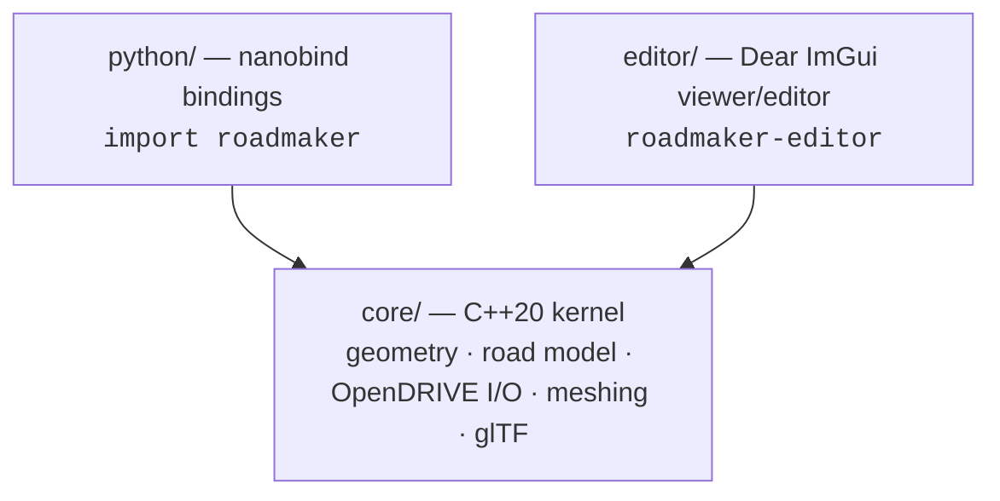

# RoadMaker

[](https://github.com/robomous/roadmaker/actions/workflows/ci.yml)
[](LICENSE)

**RoadMaker** is an open source (MIT) road-network authoring toolkit for
autonomous-driving simulation, developed by [Robomous](https://robomous.ai) —
an alternative to MathWorks RoadRunner. It authors clothoid-based road
geometry with full lane semantics, reads and writes
[ASAM OpenDRIVE](https://www.asam.net/standards/detail/opendrive/), and
generates simulation-ready 3D meshes.

The core value is **geometric and standards correctness**: exported OpenDRIVE
validates, junctions carry coherent lane logic, and meshes are watertight and
robust — rendering is deliberately the thin part.

## Architecture



Three layers, one strict rule: `core/` has zero UI, GL, or Python
dependencies; `python/` and `editor/` depend on `core/` and never on each
other.

## Milestone 1 status (viewer + kernel)

- [ ] OpenDRIVE 1.6/1.7 reader (line/arc/spiral/paramPoly3, lanes, elevation, junctions) with structured warnings
- [ ] Curvature-adaptive mesh generation with per-lane materials and lane markings
- [ ] glTF 2.0 (`.glb`) export
- [ ] Clothoid authoring API (waypoints → G1 clothoid path → valid OpenDRIVE out)
- [ ] Python package (`pip install`, pythonic API, runnable examples)
- [ ] Read-only editor: 3D viewport, scene tree, log panel
- [ ] CI on macOS / Linux / Windows with sanitizers, format check, fuzzing

## Quickstart

```sh
git clone https://github.com/robomous/roadmaker.git
cd roadmaker
cmake -B build -G Ninja -DRM_BUILD_TESTS=ON -DRM_BUILD_EDITOR=ON
cmake --build build
ctest --test-dir build --output-on-failure

# open a sample in the viewer
./build/editor/roadmaker-editor assets/samples/straight_road.xodr
```

### Python

```python
import roadmaker as rm
network, diagnostics = rm.load_xodr("assets/samples/straight_road.xodr")
rm.export_glb(network, "road.glb")
```

## Roadmap

| Milestone | Scope |
|---|---|
| **M1** | Kernel + read-only viewer: OpenDRIVE I/O, clothoid authoring, meshing, glTF, Python |
| **M2** | Interactive editing tools, 3D junction surface blending, OpenUSD export |
| **M3** | GIS/lidar import (PDAL/GDAL), OpenSCENARIO authoring |

## License

MIT © 2026 Robomous. Third-party dependencies are listed with their licenses
in [THIRD_PARTY_LICENSES.md](THIRD_PARTY_LICENSES.md).

RoadMaker is not affiliated with, endorsed by, or sponsored by The MathWorks,
Inc. RoadRunner is a trademark of The MathWorks, Inc.
