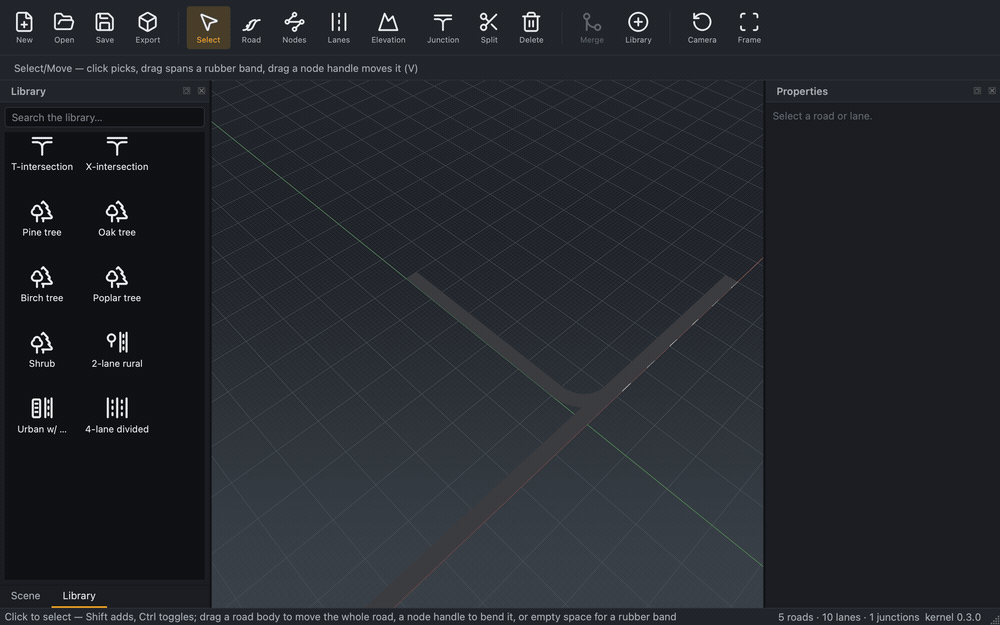

-----

# RoadMaker

[](https://github.com/robomous/roadmaker/actions/workflows/ci.yml)
[](LICENSE)

**RoadMaker** is an open source (MIT) road-network authoring toolkit for
autonomous-driving simulation, developed by [Robomous](https://robomous.ai).
It authors clothoid-based road geometry with full lane semantics, reads and
writes [ASAM OpenDRIVE](https://www.asam.net/standards/detail/opendrive/),
and generates simulation-ready 3D meshes.

The core value is **geometric and standards correctness**: exported OpenDRIVE
validates, junctions carry coherent lane logic, and meshes are watertight and
robust. A C++20 kernel does the work; a Qt 6 Widgets editor and a Python
package sit on top ([architecture](docs/architecture/overview.md)).


Drag a road assembly, an intersection, or a prop straight from the **Library**
onto the scene — every drop is one undoable edit:



Prebuilt editor packages (DMG / NSIS installer / AppImage) and Python wheels
will ship with the first release, **v0.1.0** — published when the
[Road to Parity roadmap](docs/roadmap/README.md) is complete. Until then,
`main` carries the pre-release version **0.0.1** and you build from source
below.

## Quickstart (from source)

```sh
git clone https://github.com/robomous/roadmaker.git
cd roadmaker
python3 scripts/setup_qt.py        # one-time: provisions Qt into ./.qt/
cmake --preset dev-macos           # or dev-linux / dev-windows
cmake --build --preset dev-macos
ctest --preset dev-macos
./build/dev-macos/editor/roadmaker-editor.app/Contents/MacOS/roadmaker-editor \
    assets/samples/straight_road.xodr
```

Details, kernel-only builds, and troubleshooting:
[building](docs/getting-started/building.md) ·
[running](docs/getting-started/running.md) ·
[Python quickstart](docs/getting-started/running.md#python-package)

## Documentation

New to authoring? The [user guide](docs/user-guide/index.md) walks through the
editor tool by tool.

Everything lives under [`docs/`](docs/README.md): getting started,
the [user guide](docs/user-guide/index.md),
[contributing](docs/contributing/workflow.md),
[standards](docs/standards/cpp-style.md),
[architecture](docs/architecture/overview.md),
[domain conventions](docs/domain/opendrive.md), design docs, and decision
records.

## Export formats

RoadMaker tessellates a network into simulation-ready 3D meshes and writes:

- **glTF 2.0** (`.glb`) — binary, self-contained, always available.
- **OpenUSD** (`.usda`) — ASCII only, in editor/optional builds configured with
  `-DRM_BUILD_USD=ON` (prebuilt release packages include it; Python wheels ship
  it off). `.usdc`/`.usdz` **crate** output is intentionally unsupported in M2 —
  every USD consumer (usdview, Omniverse/Isaac Sim, Blender) reads `.usda`. See
  [docs/design/m2/04_usd_export.md](docs/design/m2/04_usd_export.md).

## Roadmap

RoadMaker follows the **"Road to Parity"** roadmap
([docs/roadmap/README.md](docs/roadmap/README.md)): eight capability
pillars — interaction & navigation, roads & lanes, markings, junctions &
signals, terrain & structures, assets & props & materials, import & export,
and scenarios — that converge on a commercial-grade editing experience.
Acceptance is by hand-executed
[golden workflows](docs/roadmap/golden_workflows/README.md), and day-to-day
status lives on the public
[project board](https://github.com/Robomous/RoadMaker/projects).

**Release policy: there will be exactly one release — v0.1.0 — published
only when every pillar is complete and the
[release gate](docs/roadmap/README.md#release-gate) passes.** A release is
a promise of maturity and utility, not a development checkpoint; sprints
end with merged PRs, never with tags. Everything built from `main` reports
version **0.0.1**; that number is reset scaffolding and does not move with
sprints — it becomes `0.1.0` only at the release itself.

### Current capabilities

- ASAM OpenDRIVE 1.8/1.9 read/write/validate, clothoid geometry, watertight
  simulation-ready meshes, structured diagnostics
- Interactive editing: road/lane/elevation/junction tools with full
  undo/redo, T-junctions, topology editing, junction 3D surfaces
- Textured viewport with props and signals, dark professional theme,
  welcome screen, Library panel with drag-and-drop creation
- glTF 2.0 + OpenUSD export, esmini round-trip CI gate, Python bindings

## License

MIT © 2026 Robomous. Third-party dependencies are listed with their licenses
in [THIRD_PARTY_LICENSES.md](THIRD_PARTY_LICENSES.md); bundled assets in
[ASSETS_LICENSES.md](ASSETS_LICENSES.md).
