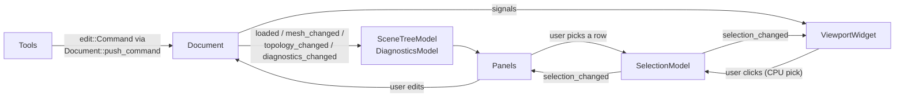

# Editor (editor/)

*Architecture of the Qt 6 Widgets editor: model/view separation, signal flow,
item models, the undo bridge, and the viewport. Layer rules live in the
[architecture overview](overview.md).*

Source layout under `editor/src/`:

| Directory | Contents |
|---|---|
| `document/` | `Document`, `SelectionModel`, `SceneTreeModel`, `DiagnosticsModel`, `EditorCommand` — all editor state and logic, testable headless |
| `panels/` | Scene tree, properties, diagnostics dock widgets — thin |
| `viewport/` | `ViewportWidget` (QOpenGLWidget), camera, CPU picking |
| `render/` | `Renderer` interface, `GLRenderer`, GL function loading, scene builder |
| `tools/` | Editing-tool state machines (`Tool`, `ToolManager`) |
| `app/` | `MainWindow`, actions, settings, the `Icons` helper, `main.cpp` |

## Model/view separation

All state and logic live in `document/` and in pure modules
(`viewport/picking`, `render/scene_builder`). Widgets only arrange and
translate — **no kernel calls from widget event handlers except through
`Document`**.

- **`Document`** is the editor's model root: it owns the `RoadNetwork`, its
  tessellation (`NetworkMesh`), the parser diagnostics, and the
  `QUndoStack`. It is the **only mutator of the network**. It is
  QtCore-only, so it tests offscreen without a GUI.
- **`SelectionModel`** is the single source of truth for the current
  selection. Every selection flow — scene tree, viewport picking,
  diagnostics navigation — goes through it; widgets never notify each other
  directly. Views that mirror the selection guard against ping-pong with a
  re-entrancy bool.
- `SelectionModel` **hard-clears on `Document::loaded()`** and validates IDs
  per call: generational IDs are only stale-safe within one `RoadNetwork`
  instance. After a reload, an old ID can alias a fresh entity, so lookups
  alone cannot detect staleness. Copy this pattern for any future
  ID-holding state.

## Signals and slots

- New-syntax `connect(&obj, &Class::signal, ...)` only — compile-time
  checked. Never the string-based `SIGNAL()`/`SLOT()` macros. No timers
  polling state.
- Parent-child ownership: widgets are `new`ed with a parent and never
  manually deleted. QObjects owned by value (the `Document` and models
  inside `MainWindow`) are declared **before** the widget pointers that
  reference them, so destruction order stays correct. `deleteLater()` only
  for objects Qt may still reference in the current event-loop turn.

## Item models — checklist

Every `QAbstractItemModel` subclass (`SceneTreeModel`, `DiagnosticsModel`,
and any future model) follows this checklist:

1. Flat snapshot rebuilt inside `beginResetModel()`/`endResetModel()` on
   `Document::loaded()` — reset-based rebuild, not incremental patching.
2. `internalId` is an **integer node index**. Never store pointers in a
   `QModelIndex`.
3. Reverse-lookup maps (e.g. `index_for_road`/`index_for_lane`) so
   `SelectionModel` changes can be mirrored into views.
4. A `QAbstractItemModelTester` (Fatal mode) GoogleTest ships **in the same
   commit** as the model — see [testing](../contributing/testing.md).

## Undo bridge

The kernel owns editing semantics ([edit command layer](kernel.md#edit-command-layer));
the editor bridges them onto Qt's undo framework:

- `Document::push_command(std::unique_ptr<edit::Command>)` is the single
  entry point for kernel mutations. It applies the command; on success it
  wraps it in a `KernelEditorCommand` (a `QUndoCommand` subclass, see
  `document/editor_command.hpp`), pushes it onto the `QUndoStack`,
  re-meshes incrementally from the command's `DirtySet`, and emits
  `mesh_changed()` (plus `topology_changed()` when roads/junctions were
  added or removed). A failed apply changes nothing, is not pushed, and
  surfaces as a diagnostic.
- `redo()` drives the kernel command's `apply`, `undo()` its `revert`.
  Because `QUndoStack` calls `redo()` immediately on push and the command is
  already applied, the bridge is constructed `already_applied` and skips
  exactly that first `redo()`.
- The stack **clears on every load** — commands must never outlive the
  network they captured snapshots of.
- The kernel's headless `edit::EditStack` is for Python and tests only; a
  document is never driven by both stacks.

Editing tools (`tools/`) are viewport-agnostic controllers: they receive
abstract events (world-space cursor, picks, modifiers) translated by
`ViewportWidget` and act on the network exclusively through `Document`
commands, so their interaction logic runs headless under GoogleTest.

## Viewport and rendering

Rendering sits behind the abstract `Renderer` interface
(`render/renderer.hpp` — no GL types in the header); `GLRenderer` is the
OpenGL 3.3 core implementation. GL code exists **only** in `editor/src/render/`
and `ViewportWidget`.

`QOpenGLWidget` lifecycle rules:

- A 3.3 core profile is requested app-wide via `QSurfaceFormat` in `main()`
  **before** `QApplication` is constructed (macOS requirement).
- `initializeGL` loads GL entry points through an injected `ProcResolver`
  (`render/gl_functions.hpp` — a plain function-pointer resolver, so the
  loader stays toolkit-agnostic), then calls `Renderer::init()`. GL
  resources are destroyed between `makeCurrent()`/`doneCurrent()`.
- Scene uploads are deferred: document signals set a dirty flag and the next
  `paintGL` uploads — never touch GL without a current context. `paintGL`
  renders at widget × `devicePixelRatioF` pixels (HiDPI-safe).
- Renderer state must stay rebuildable from `Document` at any time, so a
  lost GL context is recoverable.

Picking is **CPU-side and pure** (`viewport/picking.hpp`): ray generation
from camera matrices, per-road AABB prefilter, Möller–Trumbore triangle
intersection over the kernel mesh — no Qt, no GL, fully unit-testable
headless. Do not unit-test `paintGL`/`GLRenderer` (offscreen CI has no GL
3.3); test camera math and picking instead.

## UI sobriety

Default Qt style everywhere: no QML, no stylesheets, no custom theme, no icon
packs. Sobriety is layout discipline, not decoration. Icons are monochrome
line SVGs (stroke `currentColor`) loaded through the `Icons` helper
(`app/icons.hpp`), which tints them to the active palette so one asset serves
light and dark themes, falling back to `QIcon::fromTheme`.

## Packaging

Deployment (macdeployqt/windeployqt at install time, Linux AppImage) and
platform-specific rules are covered in
[cross-platform](../standards/cross-platform.md). Qt's LGPL constraints —
dynamic linking only — are in [dependencies](../standards/dependencies.md).
