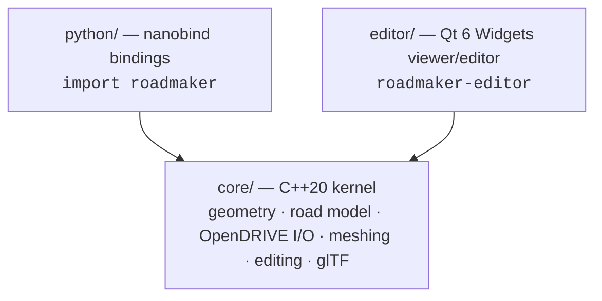

# Architecture overview

*The three-layer structure of RoadMaker and the non-negotiable rules that keep
the layers apart. Every other architecture page assumes this one.*

## The three layers



| Layer | What it is | Depends on |
|---|---|---|
| `core/` | The kernel: geometry, road data model, OpenDRIVE I/O, mesh generation, edit commands, exporters | Small vetted C++ libraries only |
| `python/` | nanobind bindings exposing the kernel as `import roadmaker` | `core/` |
| `editor/` | Qt 6 Widgets desktop application | `core/`, Qt |

`python/` and `editor/` **never depend on each other**. Everything either of
them needs from the other belongs in the kernel.

Deep dives: [kernel](kernel.md) · [editor](editor.md) ·
[Python bindings](python-bindings.md).

## The rules

### 1. The kernel is pure

`core/` never includes UI, OpenGL, Qt, or Python headers — no exceptions.

*Why:* the kernel is the product. It must build and test headless on any
platform, embed into wheels, and link into third-party tools without dragging
in a GUI toolkit. Purity is also what keeps the kernel and the Python package
pure MIT (see rule 2).

### 2. Qt is confined to the editor

Qt (LGPLv3) is the single sanctioned LGPL dependency, and it is editor-only
and **dynamically linked only**. `core/` and `python/` never include or link
Qt. The full licensing policy — allowed licenses, forbidden dependencies, how
Qt is provisioned — lives in [dependencies](../standards/dependencies.md).

*Why:* dynamic linking is what makes LGPLv3 compatible with an MIT project.
Confining Qt to one layer keeps the compliance surface small and the kernel
redistributable without conditions.

### 3. GL code lives behind the `Renderer` interface

OpenGL calls exist only in `editor/src/render/` and in the one widget that
owns a GL context (`ViewportWidget`, a `QOpenGLWidget` in
`editor/src/viewport/`). Everything else talks to the abstract `Renderer`
interface (`editor/src/render/renderer.hpp`), which has no GL types in its
header.

*Why:* rendering is deliberately the thin part of RoadMaker. A future backend
(bgfx, WebGPU) should replace `GLRenderer` without touching panels, models, or
picking code — and non-GL editor code stays testable offscreen.

### 4. One coordinate frame, one conversion point

The kernel frame is **right-handed, Z-up, meters, radians** — the OpenDRIVE
convention. Every kernel API, every mesh buffer, every editor computation uses
it. Conversion to Y-up happens **only** at the export boundary: the glTF
exporter (`core/src/io/gltf_exporter.cpp`) performs the single
`(x, y, z) → (x, z, −y)` rotation, and the future USD exporter will do the
same at its own boundary.

*Why:* axis conventions are the classic source of silent geometry bugs. One
frame everywhere plus one documented conversion point means a flipped model is
always a one-file bug. Details: [geometry conventions](../domain/geometry.md).

### 5. Arenas and generational IDs, never raw pointers

Domain objects (`Road`, `LaneSection`, `Lane`, `Junction`) live in arenas
owned by `RoadNetwork` and reference each other exclusively through
generational strong IDs (`RoadId`, `LaneSectionId`, `LaneId`, `JunctionId`).
Looking up a stale ID returns `nullptr`; pointers returned by lookups are
invalidated by any mutating call.

*Why:* road networks are graphs full of cross-references (links, junction
connections, lane links). Raw pointers between objects would make every
erase a use-after-free hazard; generational IDs make staleness detectable
and cheap to check. Details: [kernel](kernel.md#road-data-model).

## Kernel linkage: static or shared

The kernel builds as `roadmaker_core` (target alias `roadmaker::core`):

- **Static** (default) — what the editor and Python wheels embed.
- **Shared** — `-DRM_BUILD_SHARED=ON` adds install rules and a CMake package,
  so third parties can `find_package(roadmaker)` and link `roadmaker::core`.

Public API symbols carry the `RM_API` export macro (generated via CMake's
`GenerateExportHeader` into `roadmaker/export.hpp`). Default symbol visibility
is *hidden*: a public function missing `RM_API` fails to **link** in the
shared build rather than silently working on some platforms.

```sh
cmake --preset dev-macos -DRM_BUILD_SHARED=ON
cmake --build --preset dev-macos
```

## Where each rule is enforced

| Rule | Enforcement |
|---|---|
| Kernel purity | `core/` has no Qt/GL/Python include paths or link targets in CMake — a stray include fails to compile; CI builds the kernel alone (`-DRM_BUILD_EDITOR=OFF`) |
| Qt confinement / licensing | [dependency policy](../standards/dependencies.md); every dependency is pinned in `cmake/deps.cmake` and reviewed in PRs |
| GL confinement | Review + the `Renderer` interface itself (no GL types in `renderer.hpp`); editor tests run offscreen where GL misuse fails fast |
| Single frame conversion | Review + round-trip and export tests; the conversion is commented at the one site that performs it |
| IDs, not pointers | API shape (`RoadNetwork` lookups are the only way to get a pointer) + sanitizer CI jobs (ASan/UBSan) |
| `RM_API` coverage | Link errors in the shared-library CI job |

C++ style, error-handling, and naming rules are in
[cpp-style](../standards/cpp-style.md); the test doctrine is in
[testing](../contributing/testing.md).
