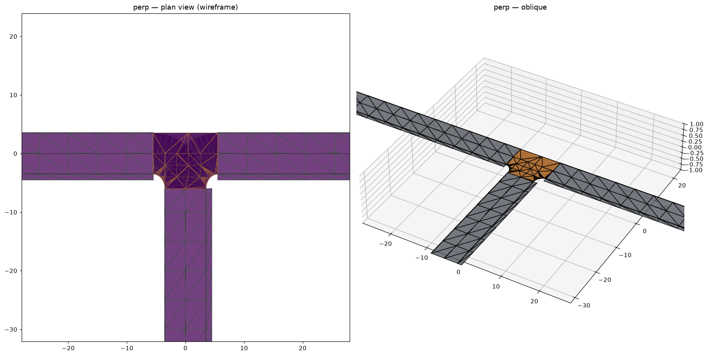
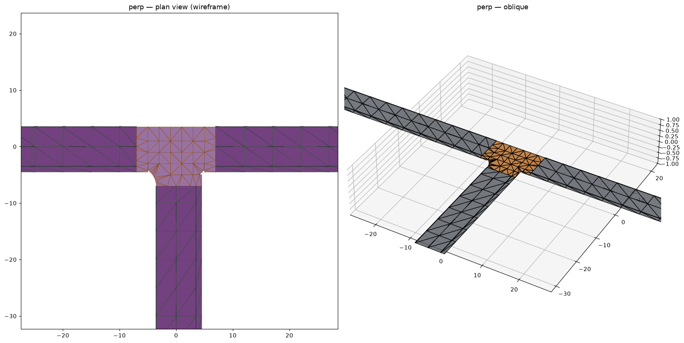
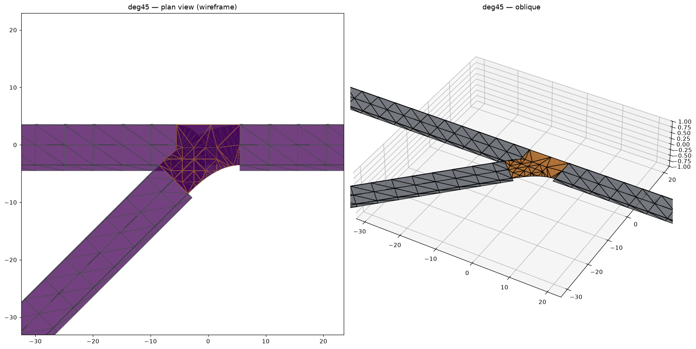
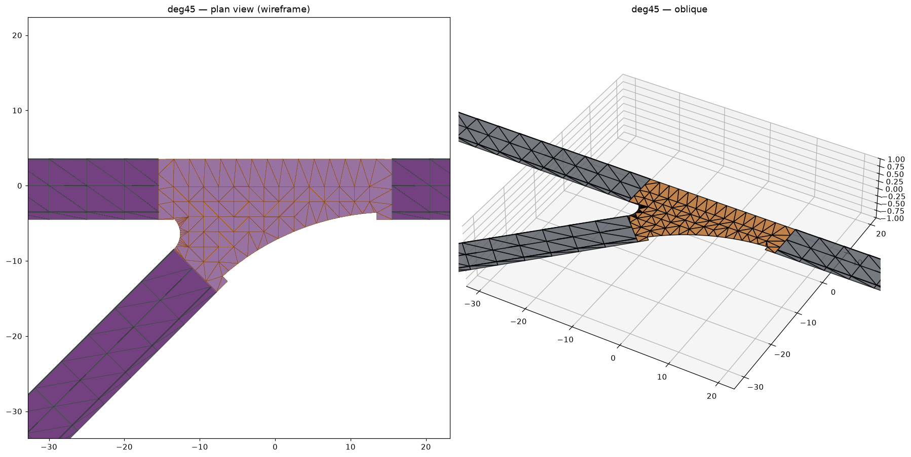
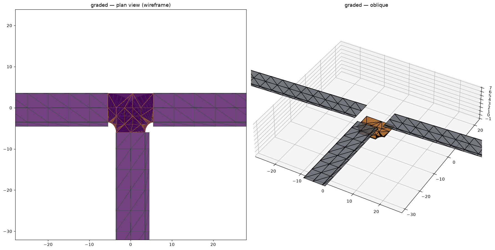
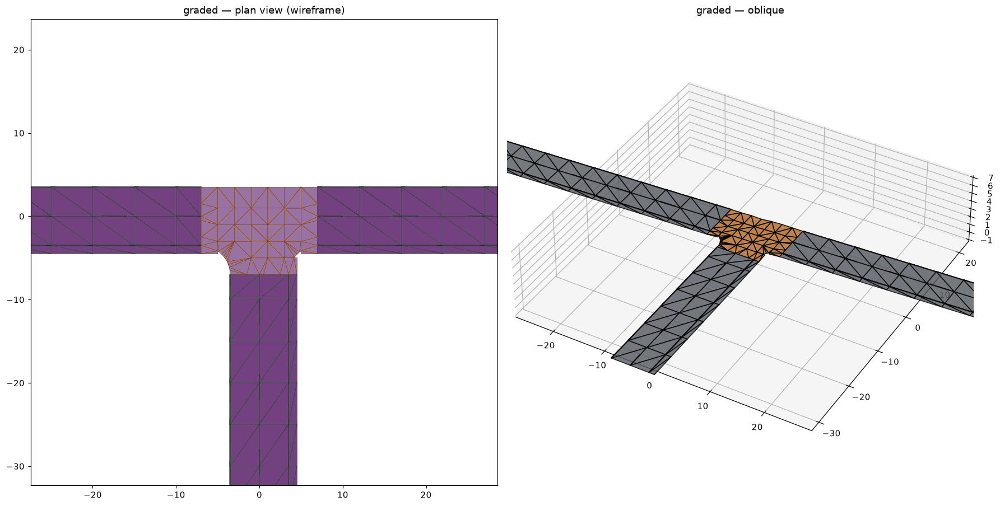
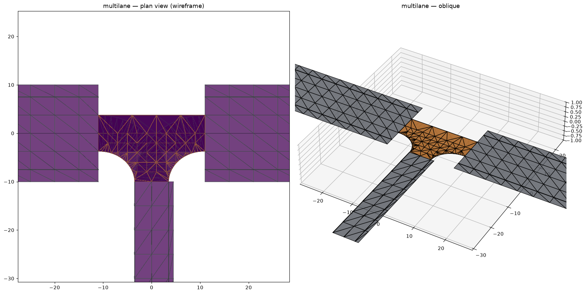
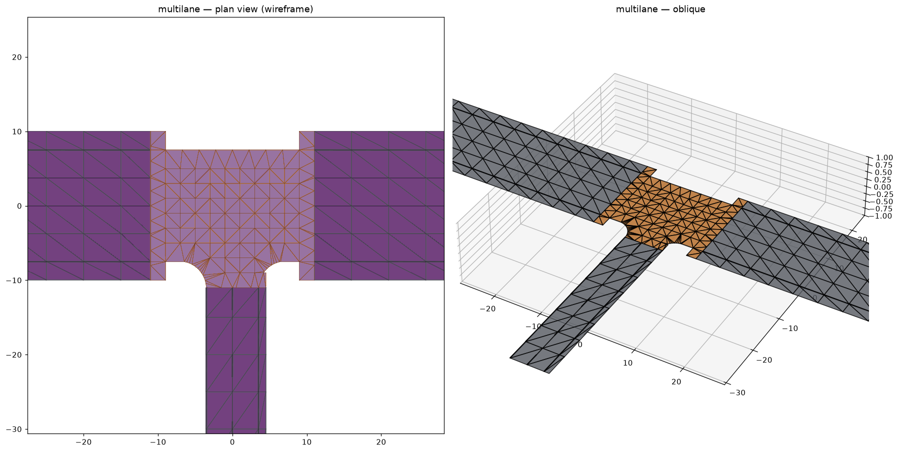
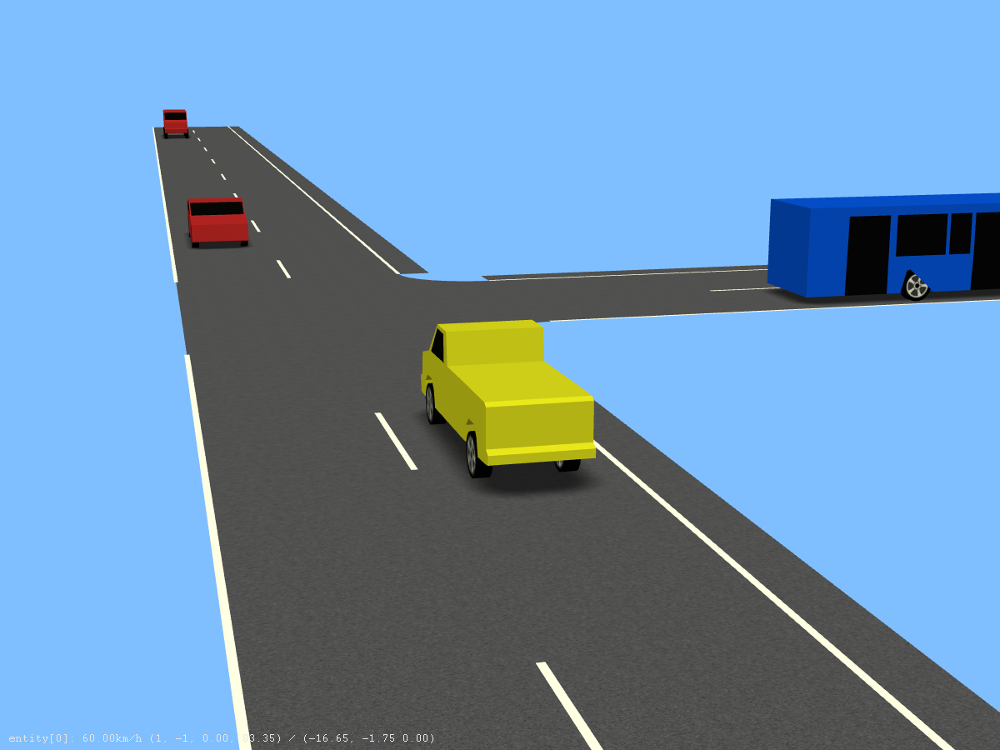
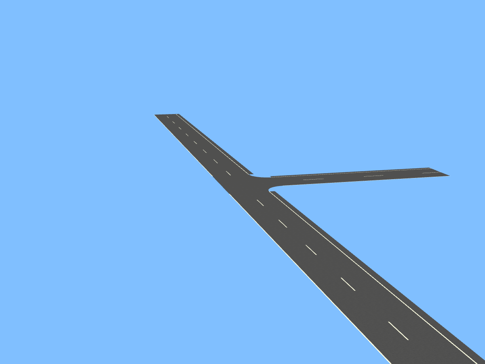

# T-junctions — split + attach-to-side (hardening sprint)

*Design for issue [#92](https://github.com/Robomous/RoadMaker/issues/92)
(kernel) and the editor side-snap slice; an as-built addendum to the M2
editing tools ([02_editing_tools.md](../m2/02_editing_tools.md)), which this
document extends rather than replaces.*

## The root-cause lesson, first

v0.3.0 could not build a T-intersection: Create Junction connects road
*endpoints* in proximity, but a T attaches an endpoint to the *side* of
another road — which requires splitting the target first, and no tool
exposed that workflow even though the kernel always had `split_road`. The
spec was written from the standard's element vocabulary ("junctions,
connecting roads, lane links exist") instead of user workflows ("draw a
road, then tee another into it — the second thing anyone draws"). The
standing rule that came out of this is in the
[product-parity standard](../../standards/product-parity.md): **every tool
spec must include workflow walkthroughs, not only element coverage.** This
document starts with one.

### Workflow walkthrough (what the user does)

1. User has road **A** and draws road **B** ending near A's side — or picks
   the Create Junction tool and drags B's endpoint toward A's side.
2. Within snap range of A's reference line, a snap indicator appears **on**
   A at the projected station `s`, and the status bar explains what release
   will do.
3. Release: A is split around `s`, a junction appears joining A's two
   halves and B, connecting roads for **all legal turns** are generated.
   ONE undo step returns everything to the pre-release state, byte-identical
   on disk.
4. Esc at any point before release cancels cleanly.

## Kernel: `attach_t_junction`

```
struct TAttachOptions {
  double gap_m = 0.0;             // 0 = auto from road widths
  JunctionGenOptions generation;  // the M2 generator knobs
};

std::unique_ptr<Command>
attach_t_junction(const RoadNetwork& network, RoadEnd end,
                  RoadId target, double s,
                  const TAttachOptions& options = {});
```

### Composition, not new machinery

The command is a **composite of four existing factories**, applied in
order and reverted in reverse:

1. `split_road(target, s + gap)` — head keeps `[0, s+gap)`, road **B'**
   gets the rest.
2. `split_road(target, s − gap)` — head keeps `[0, s−gap)`, a **middle
   stub** `[s−gap, s+gap)` appears.
3. `delete_road(middle stub)` — its referential closure frees the facing
   link slots on both neighbors (and, after the sprint's #89 fix, junction
   arms would be pruned too if any existed).
4. `create_junction({head:End, B':Start, end}, options.generation)` — the
   unmodified M2 generator.

Why the double split: a single split leaves the two facing ends
**coincident**, and the junction generator (correctly) plans connecting
roads across the *gap between* arm ends — a zero gap means zero-length
through-turns. The removed middle stub IS the junction area.

Later children are built **during the first apply** (the tail/stub ids are
assigned by the arena at apply time); redo re-applies the captured
children, so ids resurrect identically (the M2 restore-in-place contract).
Any mid-chain failure reverts the already-applied prefix — a failed apply
leaves the network untouched, per the command-layer invariant.

### Gap auto-sizing (as built — revised by the GW-1 fix, issue #103)

`gap_m = 0` derives the gap from BOTH constraints it must satisfy
(`edit::t_attach_gap`, shared by the command and the editor preview):

```
width_bound   = max(half_width(target at s), half_width(end road at its end)) + 1 m
turning_bound = min_turn_radius · tan(Δθ_worst / 2) + 1 m
gap           = max(width_bound, turning_bound)
```

with `half_width` = the wider side's total lane width,
`min_turn_radius` = `JunctionGenOptions::min_turn_radius_m` (6 m default),
and `Δθ_worst` the larger deflection of the two turn directions (branch→head
and branch→tail), clamped to 150°. On a curved target the cut faces rotate
with the reference line, so the deflection grows by the heading swept across
the gap (`gap·|κ|`, doubled when attaching on the concave side); gap appears
on both sides of that equation, resolved by 3 fixed-point rounds.

The original width-only formula was the GW-1 gate finding's root cause #1:
it bounded the junction area by road *width* while the binding constraint is
*turning geometry* — undersized gaps forced fitted turns to κ up to
0.63 m⁻¹ (r ≈ 1.6 m). RoadRunner-class editors size junction areas from
turn radii for the same reason.

**Branch trimming.** The branch face needs the same clearance from the
corner that the gap gives the target's cut faces — the editor's side-snap
places the branch end wherever the user drew it, often ON the target. The
attach therefore trims the branch's overhang back to chord-distance `gap`
from the corner (two more composite children: split + delete-stub, exactly
like the target's middle). A branch too short to reach the junction boundary
is a factory error. An explicit `gap_m` wins and skips nothing else.

### Connecting-road fitting (as built, issue #103)

- **Lane-boundary anchors.** Every connecting road's reference line is
  anchored on the linked lanes' INNER boundaries (laneOffset included) at
  both cut faces — the connecting road carries one right-hand lane (id −1)
  spanning `[−width, 0]`, so the linked lanes coincide exactly at both
  contacts (`asam.net:xodr:1.9.0:junctions.connection.smooth_fit`, §10.3
  linkage semantics). Fitting arm-center to arm-center (the original M2
  code) stacked every lane pair of a movement on the same curve and left
  multi-lane junction interiors uncovered.
- **Fillet-guided fits.** Turns are fitted through guide waypoints — the two
  tangent points and the arc midpoint of the largest circle tangent to both
  anchor rays, with headings locked (entry/exit tangents; arc-midpoint
  tangent = the travel-direction bisector). A bare 2-point G1 Hermite
  overshoots the inscribed arc's curvature by ~1.4× on asymmetric legs.
  (Near-)collinear movements — the tee's through path — take the plain
  2-point fit.
- **Lane discipline.** When a movement cannot use every lane
  (`pairs < lanes`), right turns keep the curb-in default (outermost lanes);
  LEFT turns use the INNERMOST lanes — outer-lane departures would cross the
  inner lanes' through connections, a lane-order swap the quality matrix's
  fan-out invariant forbids.
- **Elevation.** Each generated connecting road carries a cubic elevation
  profile matching the linked arms' z AND grade at both cut faces, signed
  along the connecting road's driving direction
  (`asam.net:xodr:1.8.0:junctions.elevation_grid.entry_exit_smoothness`).
  The tee cut faces inherit the target's profile at `s±gap` through
  split_road, so the junction surface is continuous on graded roads.

### Junction surface (as built, issue #103 — junction_surface.cpp)

The tee exposed gaps between the M2 blending design (03 §1) and its
implementation; the pipeline now matches the design plus hardening:

- per-arm **joint quads** (the full end cross-section extruded 2 m into the
  junction) join the footprint union, so the surface reaches every arm face;
  their vertices are the road mesh's exact end-station vertices (Dirichlet
  data + stitch targets). Emitted only when the arm list persists (≥ 2 arms,
  the writer's `rm:arms` rule) so meshing is identical across save/load;
- the union runs at **precision 6** (micrometer — Clipper2's DEFAULT of 2
  silently rounded every seam vertex to 1 cm), all inputs are welded by a
  1 cm inflation (adjacent ribbons are exactly tangent; the raw union kept
  mm-wide zigzag channels that CDT turned into sub-degree slivers), and the
  weld's overhang past each arm face is cut back to the exact cross-section
  line;
- boundary edges are subdivided to the Steiner step, Steiner points keep
  half a step of boundary clearance, boundary vertices snap bitwise onto
  road vertices within 1.2 cm (cluster-welded, exact vertices win), and
  degenerate/cap triangles are dropped;
- **connecting roads no longer emit their own lane surfaces** when junction
  floors are on: the floor IS the junction surface. The pre-fix editor drew
  both, coplanar, z-fighting across the whole interior.

### Quality gates

`core/tests/test_t_junction_quality.cpp` runs an 11-fixture tee matrix
(perpendicular / 45° / 135° / R=100 and R=30 inside+outside / asymmetric /
Start-contact / graded / multi-lane) asserting per fixture: ≤ 2 sliver
triangles (< 5°), zero degenerate/flipped triangles, zero boundary
self-intersections, zero seam mismatches, max |κ| ≤ 1/6 m⁻¹, no same-arm
fan-out crossings, seam Δz ≤ tol, bitwise-deterministic re-mesh — plus G1
contacts, validator-clean export (both versions), save/reload re-mesh
identity, and ONE-undo byte identity.

### Before / after (GW-1 finding, issue #103)

| | before | after |
|---|---|---|
| perpendicular |  |  |
| 45° |  |  |
| graded |  |  |
| multi-lane |  |  |
| esmini |  |  |

### Factory-time validation (fast, user-facing errors)

- `target`/`end.road` resolve, and `end.road != target` (self-attach is a
  loop, not a T).
- `end`'s link slot is free (same rule as `create_junction`).
- Neither road is a junction's *connecting* road. Junction-**linked** ends
  are fine: the sprint lifts the M2 "no split near junctions" restriction —
  `split_road` now remaps a successor-side junction's arm, connection table,
  and connecting-road links onto the new tail piece, so the same main road
  can be teed repeatedly (the second thing anyone draws after the first T).
- `s − gap > tol` and `s + gap < length − tol`: attach point too close to
  an end → the user wanted a normal endpoint junction; the error says so.
- paramPoly3 interiors: both splits inherit the M2 restriction; the error
  propagates verbatim.

### Turn policy (ASAM 1.9.0 §12.2–12.4, local reference)

The generator emits **all legal turns** — one `<connection>` per
(incomingRoad, connectingRoad) pair
(`asam.net:xodr:1.8.0:junctions.connection.one_link_to_incoming`),
connecting roads never incoming
(`asam.net:xodr:1.4.0:junctions.connection.connect_road_no_incoming_road`),
`<laneLink>` always written (omission is deprecated by §12.4). T-junctions
in the real world have **asymmetric permissions** (no-left-turn, one-way
arms); the default policy is deliberately *generate everything legal, let
the user prune later* — pruning UI is out of sprint scope and recorded in
the M3a+ backlog. The junction is `type="default"`; the recorded arm list
(`rm:arms`) makes it regenerate like any M2 junction when an incoming road
is edited.

## Editor UX

- **Create Junction tool** (extended, not forked): dragging a road
  endpoint within snap range of another road's *side* projects the cursor
  onto that road's reference line (the picking layer already computes
  (s, t) for hover) and shows a snap indicator at the projected `s`;
  release pushes `attach_t_junction` as ONE undo entry. Endpoint-to-
  endpoint behavior is unchanged and takes precedence inside its own snap
  radius.
- **Create Road tool**: a road may *start* (or end) on another road's
  side; on commit the editor groups `create_road` + `attach_t_junction`
  into one undo macro — same semantics, same single Ctrl+Z.
- **Esc** cancels at every stage (already the tool contract; the T path
  adds no new state that survives Esc).

## Tests

- Kernel: reject cases (near ends, junction road, occupied slot,
  self-attach); apply→revert byte-identical `write_xodr`; double-attach on
  the same road (two junctions); attach onto a two-record road across the
  record joint; regeneration after dragging the attached road's far end.
- Round-trip: build a T, save, reload, compare within tolerance; undo
  returns the exact pre-split file.
- Editor (tool-controller level): side-snap engages/disengages by radius,
  release = one undo entry, Esc mid-drag leaves the document untouched.
- GW-1 step 2 is the by-hand acceptance for the whole path.
