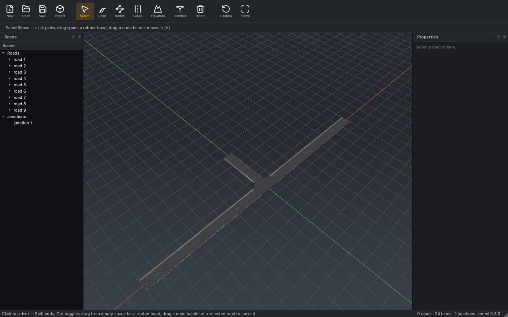
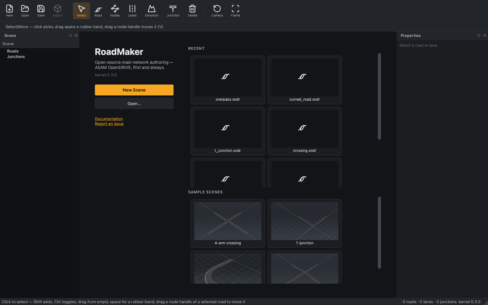

# UI revamp — Phase 0 (Look) curated renders

Phase 0 of the [UI/UX revamp epic](https://github.com/Robomous/RoadMaker/issues/108)
(issue [#109](https://github.com/Robomous/RoadMaker/issues/109)): theme
token system, labeled toolbar + tool-options row, welcome screen, viewport
backdrop. Design system: [UI design standard](../../standards/ui-design.md).

The maintainer picked **graphite-amber** from three rendered candidates
(graphite + amber · slate + cyan · warm dark + signal yellow) at the Phase 0
palette checkpoint, 2026-07-12. Reproduce any candidate with:

```sh
roadmaker-editor --screenshot-ui assets/samples/t_attach.xodr out.png --theme <name>
roadmaker-editor --screenshot-ui - welcome.png --theme <name>   # welcome screen
```

## Editing session (tee scene, default palette)



## Welcome screen (default palette)


