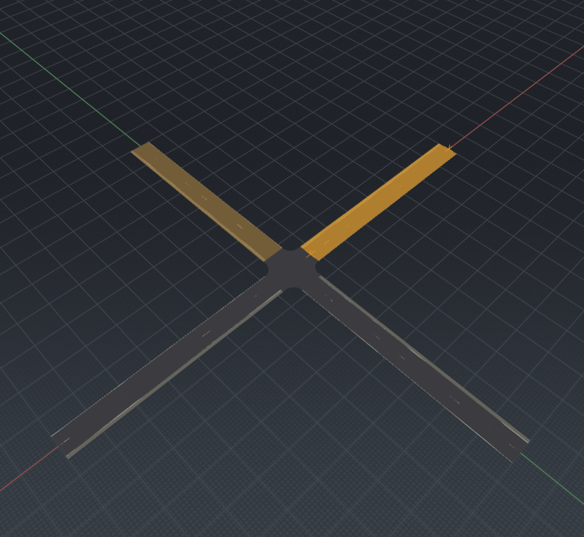

# Phase 1 — viewport feedback (design + technique notes)

Part of the M3a UI revamp (epic
[#108](https://github.com/Robomous/RoadMaker/issues/108), phase
[#111](https://github.com/Robomous/RoadMaker/issues/111)). This doc records the
render-technique choices for the viewport feedback work and carries the
before/after evidence. All colors come from theme tokens
([ui-design.md](../../standards/ui-design.md)); the renderer stays Qt-free.

## Hover highlight + selection outline (this PR)

**Delivered:** a per-`DrawItem` feedback state — `HighlightState { None, Hover,
Selected }` (`editor/src/render/renderer.hpp`) — mapped from the selection and
the hovered entity by a pure, headless function
`highlight_state_for(...)` (`editor/src/document/highlight.hpp`, unit-tested in
`editor/tests/test_highlight.cpp`). The mesh shader mixes the surface color
toward the theme **accent** token by a per-state strength: `Hover` a subtle
brighten (0.30), `Selected` a stronger tint (0.62). Selection wins over hover.
Hover is a road-level highlight tracked in `update_hover`; picking is throttled
to mouse-move frequency and repaints only when the hovered road changes.

The accent color reaches the renderer as plain floats via
`BackdropColors::highlight` (populated from `Theme::accent` in
`Theme::backdrop()`), so it retints automatically with the palette and keeps
`render/` free of Qt.

### Technique choice — accent surface tint, not a silhouette outline

The epic wording says "selection **outline** via the renderer". We evaluated a
stencil/scale-extrude silhouette pass and rejected it for now:

- Roads are near-flat ribbons at `z≈0` with **up-facing** surface normals, so a
  normal-extrude silhouette lifts the mesh vertically instead of growing an
  outline outward; a screen-space scale about a centroid balloons the far end
  of a long road. Neither reads as a clean outline.
- A true screen-space outline (jump-flood / edge-detect) needs an **offscreen
  FBO** pass the GL 3.3 renderer does not have yet.

The **two-level accent surface tint** is the cheapest technique that looks
clean here: the whole selected road reads as amber, a hovered road warms
subtly, and multi-select reads because each road tints independently. Because a
road's markings (lane edges, center line) tint with it, the selected road also
gains accent-colored edges — a pseudo-outline for free. A dedicated FBO outline
pass is a **deferred enhancement** (filed as a follow-up), not a blocker.

### Bug found and fixed along the way

The pre-existing selection tint **never actually rendered**: `u_highlight` and
`u_lit` are `float` uniforms but were set with `glUniform4f`, which is
`GL_INVALID_OPERATION` on a scalar uniform and silently leaves it at `0`.
"Selection" was therefore only ever communicated by the Select tool's node
handles. Fixed to `glUniform1f` (`editor/src/render/gl_renderer.cpp`); the
surface highlight now works, which is what makes hover visible at all.

### Capturing feedback states headlessly

Selection lives in the `SelectionModel`, but hover is viewport-local and a live
cursor isn't available in `--screenshot` mode. Two additions make the states
reproducible (and CI-trackable):

- `roadmaker-editor --screenshot ... --select <odr_id> --hover <odr_id>`
  (`editor/src/main.cpp` → `MainWindow::set_capture_highlights`) selects / hovers
  a road by OpenDRIVE id before capture. `scripts/editor_screenshot.py` forwards
  both flags; the CI `visual-artifacts` job renders a `crossing_feedback` shot.
- The forced hover is **locked** (`ViewportWidget::set_hover_preview`) so a
  spurious enter/leave/move around capture can't clear it; interactive use never
  locks, so live hover is unaffected.

### Evidence

*`--select 1 --hover 3` on `assets/samples/crossing.xodr`: road 1 selected
(strong accent), road 3 hovered (subtle accent brighten), other roads
unhighlighted.*

## Still to come in Phase 1

- **Handles/gizmos restyle** — DPI-crisp, theme-colored node/tangent sprites
  with idle/hover/grabbed states (next PR).
- **Tool-hint card + transient toast overlay** — themed top-left hint card and
  a queued toast system (next PR).
- Phase 1 closes with a hover→select→drag GIF and the maintainer look-approval
  checkpoint before Phase 2.
