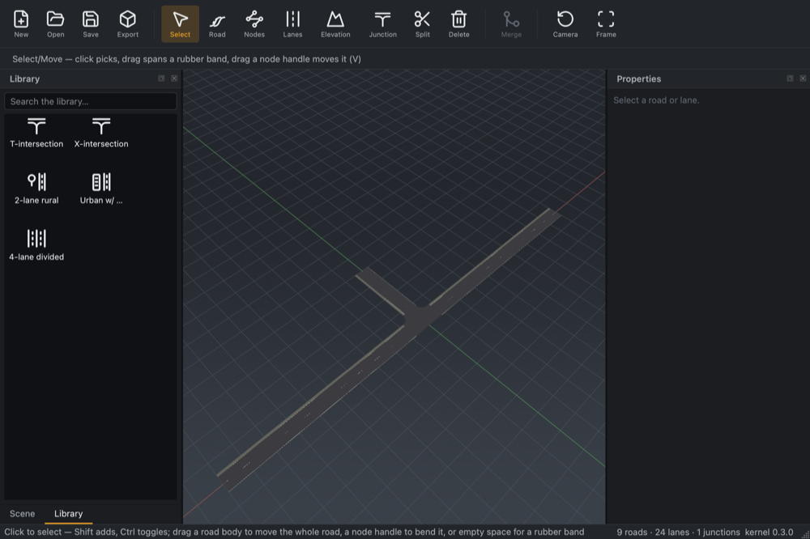

# Phase 2 — Library panel & drag-and-drop creation (design notes)

Part of the M3a UI revamp (epic
[#108](https://github.com/Robomous/RoadMaker/issues/108), phase
[#112](https://github.com/Robomous/RoadMaker/issues/112)). Phase 2 pulls the
M4 Library Browser foundation forward and supersedes the flat read-only panel
of #50. Built in slices:

1. **Manifest + model** (shipped, #128): `assets/library/manifest.json` +
   headless `LibraryManifest` / `LibraryListModel`.
2. **Kernel assemblies** (shipped, #126): `edit::assembly::t_intersection` /
   `x_intersection`.
3. **Library panel** (this PR): the browsable dock.
4. **Drag-and-drop creation** (next, P2.4): `QDrag` source + viewport drop
   handler + the behaviour matrix.

## Library panel (this PR)

**Delivered:** a **Library** dock, tabbed with the Scene tree on the left
(Scene raised by default), holding a searchable icon grid over the
`LibraryListModel`:

- `editor/src/panels/library_panel.{hpp,cpp}` — a `QLineEdit` search box over a
  `QListView` in icon mode. A `LibraryFilterProxy` (`QSortFilterProxyModel`)
  filters case-insensitively on the label, sorts by category then label so the
  classes cluster (Assemblies, then Road templates), and injects a **themed
  class icon** for the grid's `DecorationRole` — reusing the bundled
  `template-rural/urban/highway` and `junction-connect` glyphs (tinted to the
  palette by `Icons::get`), so no thumbnail assets are needed for v1.
- The manifest is loaded from the Qt resource system (`:/library/manifest.json`,
  aliased to the committed data file) so it is always available in the built
  app, then handed to the `LibraryListModel` the dock renders.
- Wiring: `main_window.cpp` `build_docks` creates `dock.library`,
  `tabifyDockWidget(scene_dock_, library_dock_)`, adds a View-menu toggle, and
  the objectName lets the layout persist.

Screenshot mode gained `--raise-dock <objectName>` (`MainWindow::
raise_dock_for_capture`) so a whole-window capture can bring the Library tab to
the front; the CI `visual-artifacts` job renders it.

### Evidence

*T/X intersection assemblies and the three road templates, grouped by class
with a search box, tabbed with the Scene tree.*

### Deferred (fast-follow)

- **Pre-rendered thumbnails** — the v1 grid uses monochrome class glyphs;
  photographic per-item thumbnails (rendered via the screenshot tooling) can
  replace the `DecorationRole` later. Distinct T vs. X glyphs too (they share
  the junction glyph now; labels disambiguate).
- **Drag-and-drop** (P2.4): the `QDrag` source, the viewport drop handler with
  ghost preview, and the create behaviour matrix.
