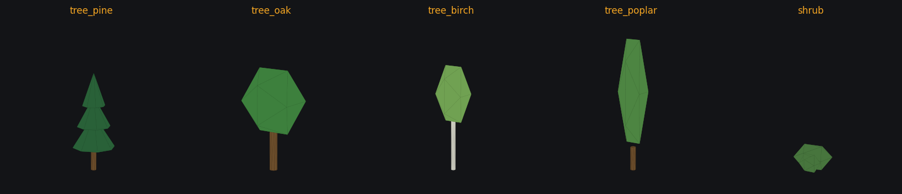
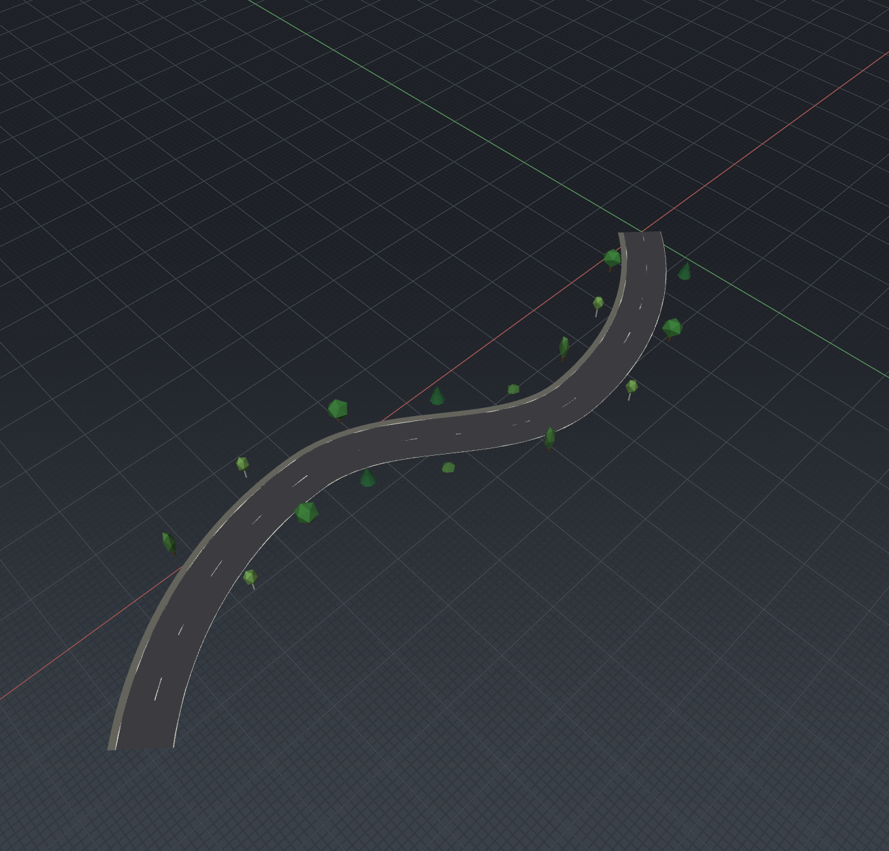
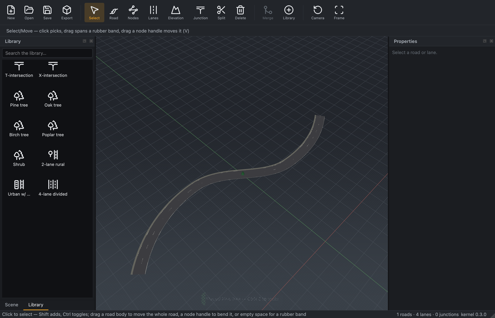

# Phase 3 — Props (trees) end-to-end (design notes)

Part of the M3a UI revamp (epic
[#108](https://github.com/Robomous/RoadMaker/issues/108), phase
[#113](https://github.com/Robomous/RoadMaker/issues/113)). Phase 3 makes the
Library able to place **trees**: drag a tree onto a road → an OpenDRIVE
`<object>` on that road → drawn in the viewport, selectable/movable/deletable,
and carried into glTF/USD exports. Built in slices (one PR each):

1. **Assets + prop library** (this doc): the bundled tree meshes + catalogue.
2. **Kernel wiring**: `edit::` object commands, prop geometry in the mesh, and
   exporter emission.
3. **Editor entity model + rendering**: `ObjectId` threaded through
   picking/selection/highlight; instanced viewport draw; select/move/delete.
4. **Placement**: drag-and-drop from the Library with a ghost preview.

## Decisions

### Trees are road-attached only (no world-xy placement)

OpenDRIVE `<object>` elements live under a `<road>` and are located by `s`/`t`
(chapter 13, `asam.net:xodr:...:road.object.*`); the format has no free-floating
world-placed object, and the RoadMaker kernel models objects strictly as
road-relative (`Object{ RoadId road; double s, t, z_offset; ... }`,
`core/include/roadmaker/road/object.hpp`). Phase 3 honours that: a tree snaps to
the nearest road's `(s, t)` within a threshold; a drop with **no road nearby
places nothing and shows a hint toast**. This keeps every placed prop
standards-valid and round-trippable, and avoids inventing a non-standard
world-xy attribute. (Maintainer decision, 2026-07-13.)

### Assets are procedurally authored original work (not fetched art)

The renderer consumes flat-shaded `positions/normals/indices` with one colour
per submesh and has no glTF/OBJ loader. Rather than fetch a third-party CC0 pack
(zip-only distribution that fights the per-file-sha256 fetch pipeline, and needs
a mesh/material parser), the trees are **procedurally authored original work**
(Apache-2.0, "original work (this repository)") — the same footing as the custom icon
glyphs. `scripts/gen_prop_meshes.py` builds five low-poly props from parametric
trunks/cones/icosahedral crowns and emits two consistent forms:

- `assets/library/props/<id>.obj` (+ `.mtl`) — an inspectable reference export
  (openable in Blender/MeshLab); purely provenance, nothing loads it at runtime.
- `core/src/assets/prop_meshes.gen.cpp` — the embedded, flat-shaded mesh table
  the kernel compiles in and exposes through `roadmaker::props::model(id)`
  (`core/include/roadmaker/assets/prop_library.hpp`).

This is deterministic, reproducible in CI (no external download), license-clean,
and adds no runtime dependency. (Maintainer decision, 2026-07-13.)

### One canonical mesh for viewport and export

`roadmaker::props` is the single source of truth for prop geometry so a tree
looks identical wherever it is drawn or exported. The kernel mesh builder places
the model at the object's world pose (road reference line + elevation, `s/t/hdg`,
`z_offset`), the editor renderer draws that geometry, and the glTF/USD exporters
emit an instance per object from the same table — no divergent art paths.

### The bundled props

| id | label | OpenDRIVE type | ~height | ~radius |
|---|---|---|---|---|
| `tree_pine` | Pine tree | `tree` | 4.2 m | 1.2 m |
| `tree_oak` | Oak tree | `tree` | 4.6 m | 1.8 m |
| `tree_birch` | Birch tree | `tree` | 4.7 m | 1.0 m |
| `tree_poplar` | Poplar tree | `tree` | 6.0 m | 0.85 m |
| `shrub` | Shrub | `vegetation` | 1.1 m | 1.1 m |

Each prop's origin is its base centre (z=0 sits on the road surface); `height`
and `radius` map to the OpenDRIVE object attributes. The Library catalogue
entries (a **Props** category in `assets/library/manifest.json` with
`create: { kind: "tree", model: "<id>" }`) land in the placement slice, together
with the editor's `kind: "tree"` parsing and the drop handler — so the shipped
catalogue never advertises an item the editor cannot yet act on.

*The five props rendered directly from the generated `assets/library/props/*.obj`
meshes (flat-shaded, trunk + crown submeshes). Viewport/export rendering is
wired in the following slices.*

## Editor integration — rendering, picking, selection (slice 3)

`ObjectId` is threaded through the editor's entity model so a placed prop is a
first-class, addressable object alongside roads and lanes:

- **Rendering.** `scene_builder` emits each prop's parts (trunk, crown, …) as
  `SceneItem`s, baking the bundled model geometry into world space at the
  instance pose and tagging every part with its `ObjectId` + owning road. This
  reuses the existing per-mesh render path (one flat colour per part), so trees
  draw with no renderer changes. *(True GPU instancing —
  `glDrawElementsInstanced` — is deferred to the standards-track #71, which
  owns "instanced props"; baking is correct and gives per-object hover/selection
  highlight for free.)*
- **Picking.** `pick()` bounding-sphere-tests each prop and shares `best_t` with
  the lane-patch test, so a tree in front of the road wins the pick; `PickHit`
  carries the hit `ObjectId`.
- **Selection & highlight.** `SelectionEntry` and the hover state gain an
  `ObjectId`; `highlight_state_for` matches a prop only by object id (selecting
  a road never lights its trees, and vice versa). Hover glow / selection outline
  reuse the road accent path.
- **Delete & context menu.** The Select tool's Delete key removes selected props
  (`delete_object`) in the same undo macro as roads (props first — they are
  leaves). The right-click menu gains an object branch: **Delete / Frame /
  Duplicate** (Duplicate places a fresh-id copy a few metres further along the
  road). **Move** (drag a prop to a new `s`/`t`) lands with the drag-and-drop
  placement slice, which shares the world→`s`/`t` machinery.
- **Re-mesh wiring.** `Document::after_kernel_mutation` regenerates only the
  owning roads' prop instances via the reserved `DirtySet::objects` channel and
  emits `objects_changed`, which prunes stale prop selections.

### Evidence

*Pine, oak, birch, poplar, and shrub props placed at road-relative `s`/`t` down
both sides of a curved road, drawn in the themed viewport
(`assets/samples/tree_avenue.xodr`).*

## Placement — drag from the Library (slice 4)

The catalogue entries deferred from slice 1 land here, with the editor able to
act on them:

- **Manifest.** The **Props** category (5 trees) is added to
  `assets/library/manifest.json`; `LibraryItem::Kind::Tree` parses
  `create.kind == "tree"` + a `model` id. The Library panel shows the props with
  a themed **trees** glyph (bundled Lucide `trees.svg`, ISC).
- **Drop.** `resolve_library_drop`'s `Tree` case snaps the drop to the nearest
  road's `(s, t)` within a threshold and builds one `add_object` command
  (radius/height from the prop model; `shrub` → `Vegetation`, else `Tree`); a
  drop with **no road nearby places nothing and shows a "drop near a road"
  hint** (road-attached-only decision). `MainWindow::on_library_drop` pushes the
  command + a success toast, or surfaces the hint.
- **Evidence.** Screenshot mode's `--drop-library` accepts a prop key; the CI
  `visual-artifacts` job renders a tree drop (`assets/samples/park_road.xodr`).

*The Library panel's Props category (pine/oak/birch/poplar/shrub with the trees
glyph); dropping a pine onto the road places it through the command layer with a
"Placed Pine tree" toast.*

**Deferred (fast-follow):** dragging a *placed* prop to a new `s`/`t` (move by
drag). The context menu's **Duplicate** + **Delete** and re-drop cover
repositioning for now; a drag-move reuses the same world→`s`/`t` snap and a
Document preview session — filed as a follow-up.

## Regenerating the props

    python3 scripts/gen_prop_meshes.py   # rewrites the OBJs and the .gen.cpp

CI does not regenerate (the committed `.gen.cpp` is the build input); rerun the
script by hand after changing a tree parameter, and commit both outputs.
