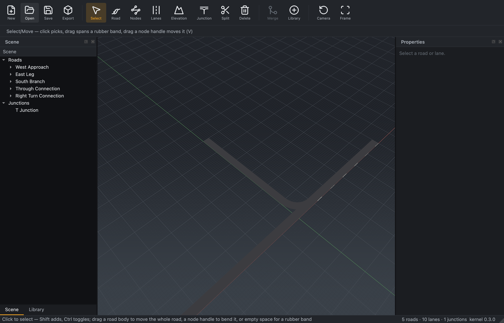

# Phase 4 — Discoverability sweep (design notes)

Part of the M3a UI revamp (epic
[#108](https://github.com/Robomous/RoadMaker/issues/108), phase
[#114](https://github.com/Robomous/RoadMaker/issues/114)). The discoverability
rule (`docs/standards/product-parity.md`): *every capability needs at least one
visible, labeled entry point — toolbar button, library item, context menu, or
panel control — plus a tooltip; no feature may exist only behind an
undocumented shortcut or a status-bar message.*

## Audit — capability → entry points

| Capability | Entry points | Gap fixed here |
|---|---|---|
| New / Open / Save / Export glTF | Toolbar (labeled) + File menu + shortcuts | — |
| Undo / Redo | Edit menu + shortcuts | — |
| Select, Create Road, Edit Nodes, Lane Profile, Elevation, Create Junction, Split, Delete | Toolbar (labeled icons) + shortcuts + tooltips | — |
| Road templates (rural/urban/highway) | Tool-options dropdown under the toolbar | — |
| **Merge roads** | Toolbar + Edit menu + road context menu | **When disabled it now says *why*** ("select two roads whose ends meet") instead of a silent grey button |
| **Add from Library** (roads, intersections, props) | **Toolbar + Edit menu** + empty-scene context menu | **Was context-menu-only** — now a labeled toolbar button + Edit-menu entry |
| **Elevation profile + Overpass Cross Over / Under** | Profile dock — **auto-opens when the Elevation tool activates** + View-menu toggle | **Overpass was reachable only through a hidden dock behind a View-menu toggle** — picking the Elevation tool now surfaces it |
| Frame selection / Reset camera | Toolbar + View menu + shortcut | — |
| Docks (Scene, Library, Properties, Diagnostics, Profile) | View-menu toggles | — |
| Reset layout | View menu | — |
| Place / select / move / delete / duplicate props | Library drag-drop + viewport context menu (Phase 3) | — |

## Fixes in this slice

- **Add from Library is a first-class action.** `Actions::add_from_library`
  gained an `iconText` ("Library") + a bundled icon and is now added to the
  **main toolbar** and the **Edit menu** (it was wired only into the
  empty-viewport context menu). One click opens/raises the Library dock.
- **Overpass / vertical profile surfaced.** Activating the **Elevation** tool
  now `show()`s and `raise()`s the Profile dock, which holds the vertical-profile
  handles and the **Cross Over / Cross Under** overpass buttons — previously the
  dock started hidden and was reachable only via the View menu, so the whole
  overpass workflow was effectively invisible. The View-menu toggle stays.
- **Merge explains itself.** The `Merge Roads` action's tooltip is now dynamic:
  enabled it reads "join the two selected roads that meet end-to-start";
  disabled it reads "select exactly two roads whose ends meet" — a greyed button
  no longer reads as broken.

Tooltips on every toolbar/menu action were already in place (`actions.cpp`);
this slice closes the remaining *entry-point* gaps, not the tooltip gaps.

### Evidence

*The labeled toolbar now carries a **Library** button (File · Tools · Merge /
Library · View); Merge is greyed with its new why-disabled tooltip until two
mergeable roads are selected.*
