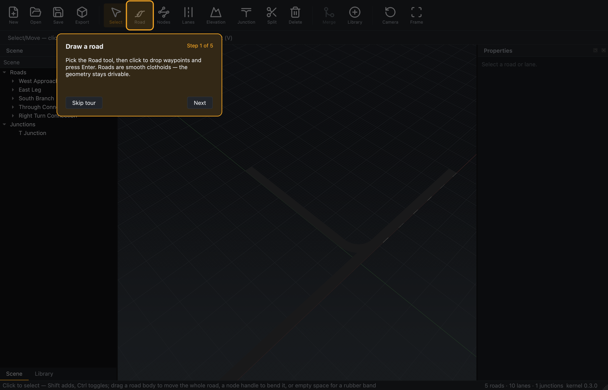

# Phase 4 — First-run guided tour (design notes)

Part of the M3a UI revamp (epic
[#108](https://github.com/Robomous/RoadMaker/issues/108), phase
[#114](https://github.com/Robomous/RoadMaker/issues/114)). A 5-step, skippable
coach-mark tour that runs once on a first launch and teaches the core loop:
**draw a road → drag in an intersection → plant a tree → shape the elevation →
export for a simulator**.

## Design

- **Headless state machine.** `TourController`
  (`editor/src/app/tour_controller.{hpp,cpp}`) holds the ordered `TourStep`s and
  a cursor — `start` / `next` / `skip` / `current` / `completed` — with no Qt
  widgets, mirroring the seam-testable `ToastQueue` pattern. Each step carries a
  `target` key equal to a toolbar action's `iconText` ("Road", "Library",
  "Elevation", "Export"), so the tour points at **real buttons**.
- **Overlay widget.** `TourOverlay`
  (`editor/src/app/tour_overlay.{hpp,cpp}`) is a standalone child of the main
  window (never the GL viewport, so it doesn't touch the render path). It dims
  the app, rings the current step's toolbar button (resolved by MainWindow via
  `QToolBar::widgetForAction`), and paints a themed card with the title, body,
  "Step i of n", and **Next** / **Skip tour** buttons. On the last step Next
  reads **Done**.
- **Never re-shown.** `MainWindow::showEvent` starts the tour once on a first
  interactive launch when `Settings::tour_seen()` is false; finishing or
  skipping sets `tour/seen = true` (a QSettings boolean — **no telemetry**).
  Capture/screenshot windows (`restore_saved_layout = false`) never auto-run it.
  **Help ▸ Guided Tour** replays it any time.
- **Capture.** Screenshot mode gained `--show-tour` (starts the overlay
  explicitly, bypassing the seen gate); the CI `visual-artifacts` job renders
  the first step.

## Evidence

*Step 1 of 5 — the app dimmed, the Road toolbar button ringed in the accent
colour, and a themed card ("Draw a road") with Skip tour / Next.*
