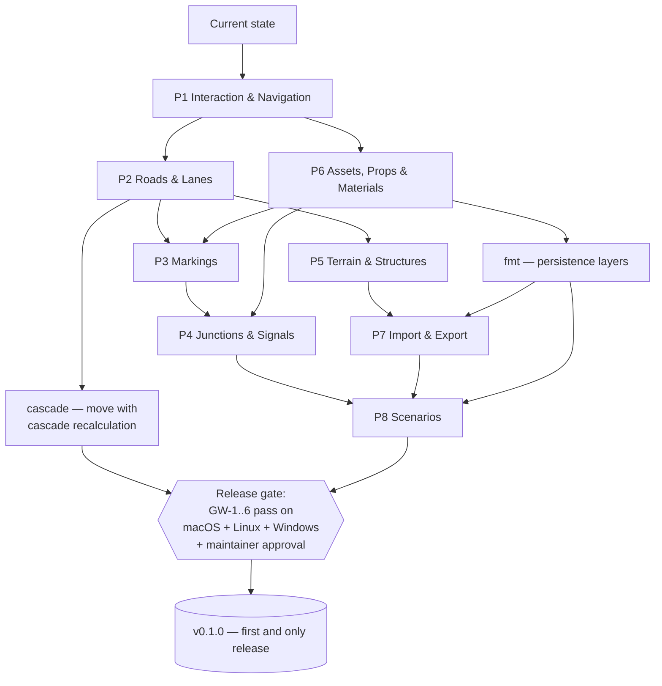

# Roadmap — "Road to Parity"

*The single source of truth for where RoadMaker is going: eight capability
pillars, their sequencing, the sprint conventions, and the one release at
the end.*

This roadmap replaces the retired milestone/version model (M1 … M5,
v0.2.0 … v0.10.0 checkpoints), which is preserved in the
[2026-07 archive](archive/2026-07-pre-reset/README.md). The goal is a
**commercial-grade road/scenario editing experience**, specified in
RoadMaker's own vocabulary and ASAM OpenDRIVE / OpenSCENARIO concepts under
the [product-parity and IP rules](../standards/product-parity.md).

## Release philosophy

1. A release is a **promise of maturity and utility**, not a development
   checkpoint.
2. There will be **exactly one release: v0.1.0**, published only when all
   sprints of all eight pillars are complete, the [release gate](#release-gate)
   passes, and the maintainer explicitly says "publish".
3. No versions per sprint. No intermediate tags. A sprint ends with a
   merged PR and updated docs — nothing more.
4. Only the maintainer publishes releases. Automation and AI agents never
   create tags or releases.

Until v0.1.0, `main` is the product: always green, always buildable from
source.

## Acceptance: golden workflows

The **only acceptance mechanism** is the golden-workflow set
[GW-1 … GW-5](golden_workflows/README.md) (plus GW-6, drafted during P8
planning): step-by-step scripts a human executes in RoadMaker, each step
with an explicit expected outcome. The earlier golden scenes and workflows
are retired; if visual scene benchmarks are wanted later, they will be
re-derived from the golden workflows.

## The eight pillars

Each pillar has a GitHub **epic issue** (labels `epic` + `pillar:PX`)
listing its sprint issues. The starting point is the current codebase:
eight editing tools, T-junctions, topology editing, vertical profile panel,
junction 3D surfaces, USD export, dark theme, welcome screen, and a
manifest-driven Library panel.

| Pillar | Name | Scope (delta from current state) | Feeds |
|---|---|---|---|
| P1 | Interaction & Navigation | Orbit-pivot camera model (pivot point of interest, push-past-pivot zoom, frame-selected / frame-on-cursor, orthographic/perspective toggle, cardinal views); Attributes pane as universal editor (scrub-editing on attribute names, drag-targets for assets/materials); 2D Editor pane as a host for profile, cross-section, and future editors; status-bar tool instructions; documented shortcut map | GW-1, all |
| P2 | Roads & Lanes | Road-plan authoring parity: extend-from-endpoint with geometric-constraint fit, forming a junction on commit (supersedes #95/#97); enclosed-area ground surfaces as a first-class `Surface` entity P5 extends; lane tool suite: Lane, Lane Width, Lane Add, Lane Form, Lane Carve (tapering cut → turn lane) over new kernel lane-section operations; road styles as draggable assets that **replace** the lane profile and boundary marks while preserving everything orthogonal to the cross section — reference-line geometry, elevation, junction connectivity (supersedes #194). Also seeds the **in-app Help system** (Qt Help Framework), permanent cross-pillar infrastructure every later pillar grows | GW-2 |
| P3 | Markings | Crosswalk & Stop Line tool (chevron placement affordance); parametric crosswalk assets; Marking Curve + Marking Point tools; drag marking assets onto lane boundaries; stencil assets (arrows); marking materials with per-instance override | GW-2, GW-5 |
| P4 | Junctions & Signals | Corner tool full parity (control-vertex/extent reshape, per-corner radius + materials, junction-wide attributes); **junction control**: a first-class stopline entity (per-road Distance, flippable, draggable — designed once, shared with P3 crosswalk stop lines and maneuver termination) and locked/custom junctions (manual creation between non-overlapping roads, convert automatic↔locked, add/remove member roads, merge junctions, junctions over parallel-road s-spans and along a single road, corner re-derivation); **junction interior surface control**: per-span sample visualization, Include Samples toggle, Sort Index with Raise/Lower; **maneuvers + signalization + signs**: maneuver roads (auto-derived per junction, editable with Lock Geometry and Convert-to-Explicit, semantic Turn Type) exporting as OpenDRIVE connecting roads; Signal tool with auto-signalize templates (incl. protected-left, static and dynamic); Signal Phase Editor hosted in the 2D Editor pane; signal/prop assemblies auto-linked to signals; Sign tool with editable text. All non-ASAM carriers per [ADR-0008](../decisions/0008-persistence-layers-asam-first.md) | GW-3, GW-4 |
| P5 | Terrain & Structures | Surface tool as a node graph with tangents; elevation ↔ terrain coupling; Road Construction tool with automatic bridge-span assignment and span inflation (supersedes #198); heightmap terrain (DEM import + brushes) as a later sprint | GW-2 |
| P6 | Assets, Props & Materials | Project model (a project is a folder of shared assets; scenes live in projects; recent scenes on the welcome screen); Library Browser with asset previews and universal drag-and-drop; Prop Point / Prop Curve (+ Bake) / Prop Span / Prop Polygon (density, randomize) tools; Prop Sets (multi-asset, portions); PBR-lite material engine + material library (supersedes #196/#197); curated CC0 starter library incl. city props (supersedes #199); instanced-rendering fast path (supersedes #201); Library Browser doubling as a **file explorer over the project's asset folders** (live tree, filesystem watcher, per-type thumbnails); **import pipelines** for user assets — images → PBR-lite materials and glTF/GLB → props (FBX permanently excluded; OBJ/USD read deferred past v0.1.0) — with drag-in from the OS file manager; **assemblies** as composite prop assets (model + Library here; signal linkage in P4); **prop sizing & spawn defaults** — per-instance size editing in the Attributes pane (scrub, multi-select, one-gesture undo) persisted through OpenDRIVE `<object>` dimensions (Layer 0), and per-asset spawn defaults (default scale) editable from the Library into the project's library-manifest overlay (Layer 2), with the starter-library trees defaulting to twice their original height. Also seeds the **fmt** persistence workstream ([ADR-0008](../decisions/0008-persistence-layers-asam-first.md)) | GW-2, GW-3, GW-5 |
| P7 | Import & Export | Scene Export Preview + OpenDRIVE Export Preview tools; **world georeference settings** — a world projection from standard CRS descriptions (WKT / proj-string), a world origin (latitude/longitude), workspace extents, and center/fit-to-selection in that frame; imports reproject into the world frame and exports record `<header><geoReference>` (OpenDRIVE §8.5); GIS vector/raster import (GDAL/PROJ); lidar (PDAL); OSM road-network extraction with diagnostics-first fitting (supersedes #54 scale targets) | GW-2 (previews) |
| P8 | Scenarios | Internal scenario model exporting **OpenSCENARIO 1.x XML** first (validation-friendly, esmini-compatible), with **OpenSCENARIO 2.x as an explicit later sprint** — an export-only concrete-scenario subset at v0.1.0, no OSC2 import or parser dependency; Map ↔ Scenario mode; actor placement; lane-anchored routes; storyboard/condition logic editor; esmini preview hooks. GW-6 is drafted as part of P8 planning | GW-6 |

## Sequencing

Rationale: P1 comes first because every golden workflow depends on the
interaction model; P6 early because the Library/Attributes drag model is a
dependency of P3 and P4; P8 last because scenarios sit on top of a finished
map editor. The `fmt` workstream (seeded by P6, per
[ADR-0008](../decisions/0008-persistence-layers-asam-first.md)) feeds P7
(georeference/workspace state) and P8 (scenario files live in the project
container). The P1 follow-up sprint `p1-s5` (toolbar information
architecture) lands **before** P4's tool wave so the new tools arrive into
a categorized toolbar.

## Sprints and issues

- Within each pillar, work is cut into sprints of 1–2 weeks of solo work.
- Issue title convention: `pN-sM: short description`
  (e.g. `p1-s2: push-past zoom + F/V framing`).
- Labels: `pillar:P1` … `pillar:P8`; pillar epics also carry `epic`.
- Every sprint issue states **Scope**, **Acceptance** (the golden-workflow
  steps it unblocks), **Out of scope**, and **Supersedes** (old issue
  numbers where applicable).
- GitHub **milestones mirror the pillars one-to-one** (`P1 — Interaction &
  Navigation` … `P8 — Scenarios`); each collects its pillar's sprint issues,
  epic, and follow-ups as a pure progress tracker. No version milestones, no
  release tasks.
- A **cross-pillar workstream** — infrastructure seeded by one pillar and
  grown by every later one — is titled for the workstream rather than the
  pillar (`help-sM: …`) and carries its own label alongside the owning
  pillar's (`help` + `pillar:P2`). The in-app Help system is the first;
  the **fmt** persistence workstream — the ASAM-first persistence layers
  and the native project container of
  [ADR-0008](../decisions/0008-persistence-layers-asam-first.md)
  (`fmt` + `pillar:P6`) — is the second. The **documentation site**
  (`docs-site` + `pillar:P2`), which grows the help system into a published
  versioned manual per
  [ADR-0009](../decisions/0009-documentation-site-tiered-docs.md), is the
  third — see [Documentation site](#documentation-site). The
  **move-with-cascade** workstream — moving a road recalculates mid-network
  connections, junction geometry, and derived layers, and flags obstructed
  props, tracked by epic
  [#406](https://github.com/Robomous/RoadMaker/issues/406) and gated on the
  road connection contract
  ([#403](https://github.com/Robomous/RoadMaker/issues/403)) — is the
  fourth. Unlike the first three it spans four pillars (P2/P4/P5/P6) with no
  single owner, so it carries the `cascade` label **without** a pillar
  milestone; the [release gate](#release-gate) names the workstream
  explicitly, which is what makes label-only tracking sufficient.

### Tracking on GitHub

Work is tracked in three synchronized places; on conflict, the epic issue's
checklist is the authoritative sprint list for its pillar:

- The [RoadMaker Roadmap project board](https://github.com/orgs/Robomous/projects/1)
  — every issue lives on the board with a current Status
  (Todo / In Progress / Done).
- One **milestone per pillar** — its progress bar is the pillar's progress.
  A milestone (and its epic) closes only when every sprint is merged **and**
  the pillar's golden-workflow hand-runs pass.
- The pillar **epic issues**, each holding the sprint checklist, follow-ups,
  and a dated status line.

| Pillar | Epic | Milestone |
|---|---|---|
| P1 Interaction & Navigation | [#250](https://github.com/Robomous/RoadMaker/issues/250) | [P1](https://github.com/Robomous/RoadMaker/milestone/8) |
| P2 Roads & Lanes | [#251](https://github.com/Robomous/RoadMaker/issues/251) | [P2](https://github.com/Robomous/RoadMaker/milestone/9) |
| P3 Markings | [#252](https://github.com/Robomous/RoadMaker/issues/252) | [P3](https://github.com/Robomous/RoadMaker/milestone/10) |
| P4 Junctions & Signals | [#253](https://github.com/Robomous/RoadMaker/issues/253) | [P4](https://github.com/Robomous/RoadMaker/milestone/11) |
| P5 Terrain & Structures | [#254](https://github.com/Robomous/RoadMaker/issues/254) | [P5](https://github.com/Robomous/RoadMaker/milestone/12) |
| P6 Assets, Props & Materials | [#255](https://github.com/Robomous/RoadMaker/issues/255) | [P6](https://github.com/Robomous/RoadMaker/milestone/13) |
| P7 Import & Export | [#256](https://github.com/Robomous/RoadMaker/issues/256) | [P7](https://github.com/Robomous/RoadMaker/milestone/14) |
| P8 Scenarios | [#257](https://github.com/Robomous/RoadMaker/issues/257) | [P8](https://github.com/Robomous/RoadMaker/milestone/15) |

### Discovery reports

A pillar's sprints are cut from the roadmap; a **discovery report** records
what the code turned out to look like, and which sprint scopes that changed.
Written once per pillar, before its first sprint lands:

- [P1 — Interaction & Navigation](pillars/p1_discovery.md)
- [P2 — Roads & Lanes](pillars/p2_discovery.md)
- [P4 — Junctions & Signals](pillars/p4_discovery.md)
- [P5 — Terrain & Structures](pillars/p5_discovery.md)
- [P6 — Assets, Props & Materials](pillars/p6_discovery.md)

### Roadmap updates

Substantial mid-flight changes to pillar scope are recorded as dated
update documents under [updates/](updates/):

- [2026-07 realignment](updates/2026-07-realignment.md) — P4 restructured
  around three behavior areas; toolbar information architecture (p1-s5);
  asset-import and file-explorer sprints in P6; georeferencing named in
  P7; OpenSCENARIO 1.x/2.x named in P8; the `fmt` persistence workstream
  and [ADR-0008](../decisions/0008-persistence-layers-asam-first.md).
- [2026-07 field triage](updates/2026-07-field-triage.md) — five maintainer
  reports diagnosed (#351): issues #352–#358, GW-1/GW-2 amendments, fix
  queue.
- [2026-07 field triage, batch 2](updates/2026-07-field-triage-2.md) — six
  maintainer reports diagnosed (#397): issues #398–#406, the #338 spec
  release, the `cascade` workstream, the P1/P2/P4 reopens, and the
  everything-before-release gate amendment.

## Documentation site

A cross-pillar workstream (`docs-sM` issues, label `docs-site`, under
milestone [P2 — Roads & Lanes](https://github.com/Robomous/RoadMaker/milestone/9)),
tracked by epic [#344](https://github.com/Robomous/RoadMaker/issues/344) and
decided in
[ADR-0009](../decisions/0009-documentation-site-tiered-docs.md). It grows the
in-app Help system seeded by P2 (`help-s1`/`help-s2`) into a published,
versioned web manual **without** giving up in-app `F1`.

### Two tiers, one bridge

The Qt Help pipeline is kept permanently, but its scope narrows to what it
does best. The split is by the **role of the content**, not by format:

| Tier | Source | Rendered by | Syntax budget |
|---|---|---|---|
| Reference | `docs/user-guide/reference/` | `.qch` (in-app, `F1`) **and** the site | Strict CommonMark subset — `QTextBrowser` renders a limited HTML/CSS subset |
| Guides | `docs/user-guide/guides/`, `docs/user-guide/tutorials/` | The site only | Markdown plus Starlight asides; MDX/JS components deferred |

Reference pages are short per-tool and per-panel pages: what it does, its
parameters, its shortcuts, a couple of paragraphs. The `helpId()` mapping
and the tool/panel coverage test apply to **this tier only**. Guides are
tutorials, workflow walkthroughs, and getting-started material — long or
visual content that never passes through the `.qhp` pipeline.

**The bridge:** every reference page ends with a "full guide" link to its
matching guide. The in-app viewer opens it in the external browser
(`QDesktopServices::openUrl`) into the packaged HTML manual; on the site it
is an ordinary link. `F1` gives the instant answer, one click gives the rich
version.

Rationale: forcing all content through both pipelines condemns everything to
the lowest-common-denominator Markdown the in-app viewer accepts, and
produces defects like [#292](https://github.com/Robomous/RoadMaker/issues/292)
and [#297](https://github.com/Robomous/RoadMaker/issues/297). The tiered
model shrinks the dual-source surface to the reference pages alone.

### Source, tooling, and constraints

- `docs/user-guide/` stays the **sole authored source**; it gains the tier
  folders above. The site ingests it at build time through an adapter script
  (Node) that copies content, synthesizes `title` frontmatter from each
  page's first H1, rewrites relative links and images for site routing, and
  fails loudly on a broken link. Adapter output is generated and gitignored;
  hand-editing it is forbidden.
- `docs/user-guide/index.md` is already the `.qhp` pipeline's **ordering
  manifest** — the generator ingests exactly the pages that page links, in
  link order — so it keeps that role for the reference tier and the adapter
  reads the same order. Guides order by folder structure plus an optional
  `_order` manifest the `.qhp` generator ignores.
- Astro Starlight lives in a new top-level `docs-site/` folder. `docs/`
  remains the public contributor source of truth; `docs-site/` is tooling.
  Node LTS pinned (`engines` + `.nvmrc`), `package-lock.json` committed,
  `npm ci` in CI, every npm dependency MIT/BSD/Apache-2.0-compatible per the
  [dependency policy](../standards/dependencies.md). Site CI runs on **Linux
  runners only**.
- **The C++/CMake build stays Node-free.** CMake never invokes npm.
  Packaging jobs build the manual with Node first and hand the prebuilt
  folder to CMake behind `ROADMAKER_BUNDLE_MANUAL` (default `OFF`), so a
  developer build never requires Node.
- The site theme reuses the graphite + amber tokens extracted in `help-s1`,
  so in-app help and the website read as one product family.

### Build modes and in-app integration

- **Local reader build** ships inside each release and opens straight from
  `file://` — file-format output, fully relative asset and link references,
  search disabled (Pagefind cannot index over `file://` in mainstream
  browsers) with a note on the local landing page. We never ship a broken
  search box. CI fails the build if any root-absolute path survives.
- **Web build** is standard Starlight output with search enabled and a
  configurable `--base=/<segment>/`.
- Install layout: `RoadMaker.app/Contents/Resources/manual/` (macOS),
  `share/roadmaker/manual/` (Linux), `manual/` beside the executable
  (Windows). A Help-menu action opens `manual/index.html` in the default
  browser and degrades to a friendly pointer at the web docs when the folder
  is absent (dev builds). `F1` behavior is untouched. Embedding a Chromium
  web view in-app is [explicitly
  rejected](../decisions/0009-documentation-site-tiered-docs.md#alternatives-rejected).

### Publishing

GitHub Actions assembles a published tree — `dev/` from `main`, `vX.Y.Z/`
from each release tag, `latest/` as the highest semver, a root redirect, and
a root `versions.json` driving a header version dropdown — onto a
publishing branch that **AWS Amplify Hosting serves prebuilt**. Workflows
only *react* to tags; consistent with the [release
philosophy](#release-philosophy), they never create them, and every
publishing action is the maintainer's. The pipeline works with `dev/` alone
today and grows versions when v0.1.0 lands.

### Sprints

| Sprint | Scope | Exit criteria |
|---|---|---|
| [`docs-s1`](https://github.com/Robomous/RoadMaker/issues/345) | Tier restructure of `docs/user-guide` (`reference/` + `guides/`/`tutorials/`), `.qhp` generator narrowed to `reference/`, `docs-site/` scaffold, adapter, Linux/Node CI workflow | Both pipelines green from the restructured source with no dual-syntax hacks; F1 coverage green through the move; every F1-required page also present in the adapted site set; C++ jobs untouched |
| [`docs-s2`](https://github.com/Robomous/RoadMaker/issues/346) | Local reader build, release packaging behind `ROADMAKER_BUNDLE_MANUAL`, Help-menu "open manual" action, reference→guide bridge convention | Packaged build on one platform opens the manual from the Help menu; local build passes the no-absolute-paths check; bridge targets verified in CI; `F1` untouched |
| [`docs-s3`](https://github.com/Robomous/RoadMaker/issues/347) | Web build with configurable base, versioned assembly workflows, header version dropdown, `amplify.yml`, maintainer publishing runbook | `dev/` assembly works from `main`; a `workflow_dispatch` dry run demonstrates versioned assembly into a scratch prefix; nothing creates tags |
| [`docs-s4`](https://github.com/Robomous/RoadMaker/issues/348) | Link-check hardening, contributor authoring guide for the two tiers, `docs-site/` dependency hygiene, IP-rule sweep, drift check against this section and ADR-0009 | A reviewer following the guide adds one reference page and one guide page and each appears in its correct pipeline(s) with no extra steps |

## Release gate

v0.1.0 may be published only when **all** of the following hold:

1. Every sprint issue of P1–P8 is closed via merged PRs with green CI.
2. Every **cross-pillar workstream** issue (`help`, `fmt`, `docs-site`,
   `cascade` — including every sprint of the
   [move-with-cascade epic #406](https://github.com/Robomous/RoadMaker/issues/406))
   and every follow-up/bug issue **existing as of 2026-07-23** (the
   [batch-2 field triage](updates/2026-07-field-triage-2.md)) is closed via
   merged PRs. Concretely: **an open issue created on or before 2026-07-23
   blocks the release unless the maintainer explicitly re-scopes it** — the
   gate is checkable from the issue tracker alone (maintainer decision,
   2026-07-23).
3. The maintainer has executed **every golden workflow (GW-1 … GW-6) by
   hand** on macOS, Linux, and Windows, and recorded a pass in each
   workflow's results table (date, OS, commit).
4. A 24 h ASan soak run on the release-candidate commit completes with
   zero crashes.
5. `docs/` is fully synchronized (no references to the retired
   milestone/version model anywhere in the repo outside the archive), and
   the [documentation site](#documentation-site) is release-ready:
   1. the Starlight build is green in CI;
   2. the maintainer has hand-verified that the local reader build opens
      correctly from `file://` in a browser on macOS, Linux, and Windows;
   3. the Help-menu "open manual" action works in the packaged app;
   4. reference→guide bridge links resolve in both directions.
6. The maintainer gives explicit written approval ("publish v0.1.0").
   Automation and AI agents never tag or publish.
