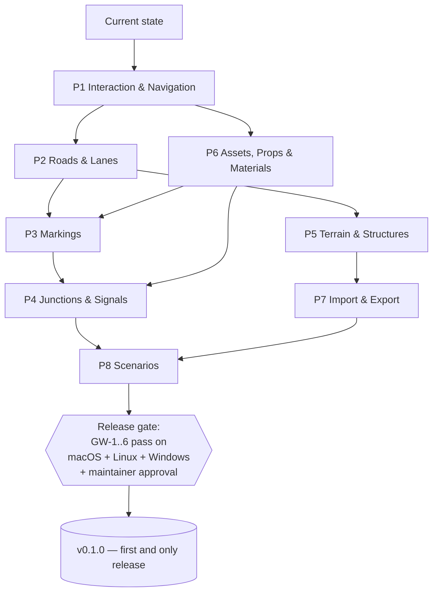

# Roadmap — "Road to Parity"

*The single source of truth for where RoadMaker is going: eight capability
pillars, their sequencing, the sprint conventions, and the one release at
the end.*

This roadmap replaces the retired milestone/version model (M1 … M5,
v0.2.0 … v0.10.0 checkpoints), which is preserved in the
[2026-07 archive](archive/2026-07-pre-reset/README.md). The goal is a
**commercial-grade road/scenario editing experience**, specified in
RoadMaker's own vocabulary and ASAM OpenDRIVE / OpenSCENARIO concepts under
the [product-parity and IP rules](../standards/product-parity.md).

## Release philosophy

1. A release is a **promise of maturity and utility**, not a development
   checkpoint.
2. There will be **exactly one release: v0.1.0**, published only when all
   sprints of all eight pillars are complete, the [release gate](#release-gate)
   passes, and the maintainer explicitly says "publish".
3. No versions per sprint. No intermediate tags. A sprint ends with a
   merged PR and updated docs — nothing more.
4. Only the maintainer publishes releases. Automation and AI agents never
   create tags or releases.

Until v0.1.0, `main` is the product: always green, always buildable from
source.

## Acceptance: golden workflows

The **only acceptance mechanism** is the golden-workflow set
[GW-1 … GW-5](golden_workflows/README.md) (plus GW-6, drafted during P8
planning): step-by-step scripts a human executes in RoadMaker, each step
with an explicit expected outcome. The earlier golden scenes and workflows
are retired; if visual scene benchmarks are wanted later, they will be
re-derived from the golden workflows.

## The eight pillars

Each pillar has a GitHub **epic issue** (labels `epic` + `pillar:PX`)
listing its sprint issues. The starting point is the current codebase:
eight editing tools, T-junctions, topology editing, vertical profile panel,
junction 3D surfaces, USD export, dark theme, welcome screen, and a
manifest-driven Library panel.

| Pillar | Name | Scope (delta from current state) | Feeds |
|---|---|---|---|
| P1 | Interaction & Navigation | Orbit-pivot camera model (pivot point of interest, push-past-pivot zoom, frame-selected / frame-on-cursor, orthographic/perspective toggle, cardinal views); Attributes pane as universal editor (scrub-editing on attribute names, drag-targets for assets/materials); 2D Editor pane as a host for profile, cross-section, and future editors; status-bar tool instructions; documented shortcut map | GW-1, all |
| P2 | Roads & Lanes | Road-plan authoring parity: extend-from-endpoint with geometric-constraint fit, enclosed-area ground surfaces (supersedes #95/#97); lane tool suite: Lane, Lane Width, Lane Add, Lane Form, Lane Carve (tapering cut → turn lane); road styles as draggable assets preserving prior attributes (supersedes #194) | GW-2 |
| P3 | Markings | Crosswalk & Stop Line tool (chevron placement affordance); parametric crosswalk assets; Marking Curve + Marking Point tools; drag marking assets onto lane boundaries; stencil assets (arrows); marking materials with per-instance override | GW-2, GW-5 |
| P4 | Junctions & Signals | Corner tool full parity (control-vertex/extent reshape, per-corner radius + materials, junction-wide attributes); custom-junction and junction-surface groundwork; Signal tool with auto-signalize templates (incl. protected-left); Signal Phase Editor hosted in the 2D Editor pane; maneuver roads; signal/prop assemblies auto-linked to signals; Sign tool with editable text | GW-3, GW-4 |
| P5 | Terrain & Structures | Surface tool as a node graph with tangents; elevation ↔ terrain coupling; Road Construction tool with automatic bridge-span assignment and span inflation (supersedes #198); heightmap terrain (DEM import + brushes) as a later sprint | GW-2 |
| P6 | Assets, Props & Materials | Project model (a project is a folder of shared assets; scenes live in projects; recent scenes on the welcome screen); Library Browser with asset previews and universal drag-and-drop; Prop Point / Prop Curve (+ Bake) / Prop Span / Prop Polygon (density, randomize) tools; Prop Sets (multi-asset, portions); PBR-lite material engine + material library (supersedes #196/#197); curated CC0 starter library incl. city props (supersedes #199); instanced-rendering fast path (supersedes #201) | GW-2, GW-3, GW-5 |
| P7 | Import & Export | Scene Export Preview + OpenDRIVE Export Preview tools; GIS vector/raster import (GDAL/PROJ); lidar (PDAL); OSM road-network extraction with diagnostics-first fitting (supersedes #54 scale targets) | GW-2 (previews) |
| P8 | Scenarios | OpenSCENARIO model; Map ↔ Scenario mode; actor placement; lane-anchored routes; storyboard/condition logic editor; esmini preview hooks. GW-6 is drafted as part of P8 planning | GW-6 |

## Sequencing

Rationale: P1 comes first because every golden workflow depends on the
interaction model; P6 early because the Library/Attributes drag model is a
dependency of P3 and P4; P8 last because scenarios sit on top of a finished
map editor.

## Sprints and issues

- Within each pillar, work is cut into sprints of 1–2 weeks of solo work.
- Issue title convention: `pN-sM: short description`
  (e.g. `p1-s2: push-past zoom + F/V framing`).
- Labels: `pillar:P1` … `pillar:P8`; pillar epics also carry `epic`.
- Every sprint issue states **Scope**, **Acceptance** (the golden-workflow
  steps it unblocks), **Out of scope**, and **Supersedes** (old issue
  numbers where applicable).
- No milestones, no version labels, no release tasks.

## Release gate

v0.1.0 may be published only when **all** of the following hold:

1. Every sprint issue of P1–P8 is closed via merged PRs with green CI.
2. The maintainer has executed **every golden workflow (GW-1 … GW-6) by
   hand** on macOS, Linux, and Windows, and recorded a pass in each
   workflow's results table (date, OS, commit).
3. A 24 h ASan soak run on the release-candidate commit completes with
   zero crashes.
4. `docs/` is fully synchronized (no references to the retired
   milestone/version model anywhere in the repo outside the archive).
5. The maintainer gives explicit written approval ("publish v0.1.0").
   Automation and AI agents never tag or publish.
