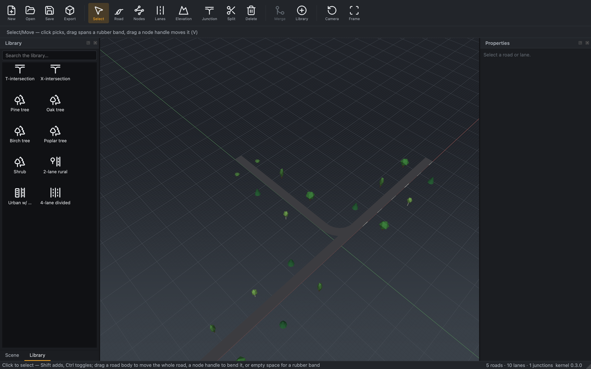

# UI design standard

*The visual design system of the RoadMaker editor: palette tokens, spacing,
icon sizes, typography, and the do/don'ts that keep every surface looking
like one deliberate product. Born with the M3a UI revamp
([product parity — visual experience](product-parity.md)).*

The editor must read as a modern professional DCC tool. Everything visual
is driven by the **theme token system** in `editor/src/theme/` — widgets
never hardcode colors; the viewport backdrop takes its colors from the same
tokens (handed to the renderer as plain floats, keeping `render/` Qt-free).

## Technology (locked)

Qt Widgets: **Fusion style base + dark `QPalette` + one token-injected QSS
file** for chrome (toolbar, docks, tabs, buttons), custom-painted widgets
where QSS falls short (library thumbnails, overlay cards, welcome screen),
and viewport improvements in our GL layer. No QML/web rewrite.

## Palette tokens

| Token | Role |
|---|---|
| `bg0` | Deepest layer: welcome-screen backdrop, viewport surround |
| `bg1` | Panels, docks, menus (`QPalette::Window`) |
| `bg2` | Elevated chrome: toolbar, dock titles, cards, headers |
| `bg_input` | Inputs, item views (`QPalette::Base`) |
| `border` / `border_strong` | Hairlines between layers / emphasized outlines |
| `text_primary` | Body text, labels |
| `text_secondary` | Captions, group labels, secondary info |
| `text_disabled` | Disabled controls |
| `accent` | Interactive emphasis: checked tools, selection, links, focus |
| `accent_hover` | Hover state of accented controls |
| `on_accent` | Text/glyphs painted on top of `accent` |
| `warning` / `error` / `success` | Diagnostics severities, toasts |
| `sky_top` / `sky_horizon` | Viewport background gradient |
| `grid_major` / `grid_minor` | Viewport ground grid (10 m / 1 m lines) |

Icons are monochrome SVGs tinted at load to the palette's text color
(`Icons::get`); the accent is reserved for state, never for icon fills.

**Default palette: `graphite-amber`** — maintainer pick from the three
rendered candidates (graphite + amber · slate + cyan · warm dark + signal
yellow), 2026-07-12. Values live in `editor/src/theme/theme.cpp`:

| Token | Value | | Token | Value |
|---|---|---|---|---|
| `bg0` | `#131417` | | `accent` | `#f5a623` |
| `bg1` | `#1b1d21` | | `accent_hover` | `#ffb84d` |
| `bg2` | `#22252a` | | `on_accent` | `#1f1600` |
| `bg_input` | `#101114` | | `warning` | `#e3b341` |
| `border` | `#2e3238` | | `error` | `#e5534b` |
| `border_strong` | `#434951` | | `success` | `#57ab5a` |
| `text_primary` | `#e8eaed` | | `sky_top` | `#1d2026` |
| `text_secondary` | `#a7adb5` | | `sky_horizon` | `#3a4149` |
| `text_disabled` | `#5f666e` | | `grid_major` / `grid_minor` | `#535a63` / `#33383f` |

The two alternates stay selectable via `--theme <name>` for screenshots
and A/B comparisons.

## Spacing, radii, sizes

- **Spacing scale (px): 4 · 8 · 12 · 16 · 24 · 32.** No off-scale margins.
- **Corner radius:** 4 px controls, 8 px cards/overlay panels.
- **Icon sizes:** 28 px main toolbar (labeled, text under icon), 20 px
  panel controls, 16 px menus and dock title bars.
- **Hit targets:** minimum 24 px in panels, toolbar buttons ≥ 56 px wide
  including label.

## Typography

System UI font only (no bundled fonts). Base 13 px; secondary/captions
12 px; dock titles 12 px medium, letter-spaced; welcome-screen hero ~28 px.
Numbers in coordinate readouts use tabular figures where available.

## Do / don't

- **Do** take every color from a token; **don't** hardcode hex values in
  widgets, QSS fragments, or painters.
- **Do** give every capability a visible, labeled entry point + tooltip
  (discoverability rule in [product parity](product-parity.md));
  **don't** ship features reachable only by shortcut.
- **Do** ship a screenshot/GIF with every UI PR (iteration rule);
  **don't** land invisible UI refactors.
- **Do** keep icons monochrome-tinted Lucide/custom-on-Lucide-grid
  ([assets](assets.md)); **don't** introduce colored icon soup or copy any
  vendor's iconography, palette, or artwork (IP guardrail).
- **Do** style both light-on-dark states (normal, hover, checked, disabled)
  when touching chrome; **don't** leave Fusion defaults peeking through a
  themed surface.
- **Don't** relitigate the stack (Qt Widgets) or the dark-professional
  direction; propose token changes instead.

## Tools vs. content (the Library-first rule)

Every new capability is either an **interaction mode** (a toolbar tool: how the
user acts on the scene) or an **asset application** (content the user places).
Before adding a tool, decide which it is:

- **Content** — anything the user *chooses* an instance of (a template, a
  marking style, a material, a prop, a signal, a stencil) — enters through the
  **Library**. Selecting or dragging the asset arms the matching placement tool
  with that asset current (`MainWindow::arm_tool_for_library_item`), so the
  toolbar button is the *mode* and the Library is where the *choice* is made.
  Don't ship a tool that places a hard-coded asset the Library could supply.
- **Modes** — geometric and topology actions with no asset (draw, bend, split,
  form a junction, scatter along a curve) — live on the toolbar. They may read
  the current Library asset but they are not redundant with it.

The user-facing contract is [tools and the Library](../user-guide/tools-and-library.md).

## Toolbar structure (two plain grouped rows)

The toolbar is **generated from the action registry** (`shortcut_registry.cpp`
`kToolbarGroups`), never hand-placed, and a gtest (`toolbar_violations`) fails
CI on an uncategorized tool. It is **two rows, each a plain top-level
`QToolBar`** in the top tool-bar area — the standard `QMainWindow` idiom — so
they share one left origin and align by construction. There are **no category
tabs and no nested widgets**: a `QToolBar` nested in a `QStackedWidget` nested
in a `QToolBar`, and tabs that swapped the tool row's contents, were both
non-standard improvisations that kept misaligning the row (issue #377).

- The **core row** (`toolbar.main`) — never hides — carries document ops: file
  ops, the universal edit tools (Select/Move/Split/Delete/Merge), and
  framing/camera/Library (the `ToolbarTab::kCore` groups).
- The **tool row** (`toolbar.tools`) shows **every** placement/edit tool at
  once, the tool groups (Roads · Lanes · Markings · Props · Signals …)
  separated by `QToolBar` separators, with Qt's native overflow chevron when
  the window is too narrow. Reserved pillars (Terrain, Scenario) contribute
  nothing until they land a tool.

The `ToolbarTab` taxonomy still classifies every tool into a group — it drives
the CI gate and keeps the flat row's ordering stable — but it no longer renders
as tabs; the whole taxonomy is laid out flat on the single tool row.

Rules for adding a tool: give it a `toolbar_group` (the CI gate) that places
it; **never** put a file/edit/framing action on the tool row (it belongs to the
`kCore` groups on the core row); keyboard shortcuts fire regardless of overflow.
The persisted window layout is versioned (`Settings` `kWindowStateVersion`) so a
structural toolbar change discards a stale saved layout instead of misapplying
it.

## Acceptance

Visual changes are accepted with pixels: before/after screenshots in the
PR, maintainer approval before merge
([pull requests — visual output](../contributing/pull-requests.md)). The
milestone-level bar is the **golden look** screenshot — one canonical UI
capture (defined camera, themed app, library open, tee scene loaded)
tracked release-over-release like golden scenes.

The current baseline is [`golden-look.png`](golden-look.png), captured from
`assets/samples/golden_scene.xodr` (a T-junction lined with tree props, the
Library dock raised) with:

```sh
python scripts/editor_screenshot.py --ui \
    assets/samples/golden_scene.xodr docs/standards/golden-look.png \
    --size 1600x1000 --raise-dock dock.library
```

Re-capture it whenever the chrome or theme changes so the baseline stays
current; the M3a UI revamp (epic
[#108](https://github.com/Robomous/RoadMaker/issues/108)) established it.


