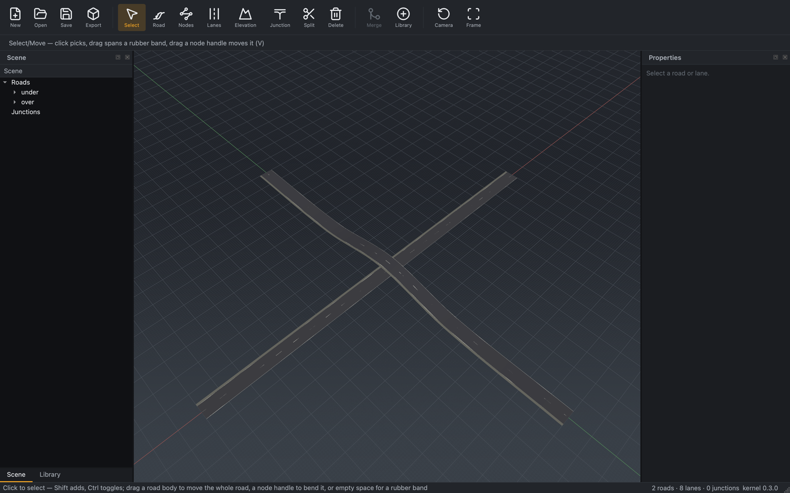

# Elevation

*Give a road a vertical profile so it rises, dips, and grades smoothly.*

## Steps

1. Select a road, then activate the **Elevation** tool.
2. Add or drag elevation control points along the road's length. RoadMaker
   fits a smooth (cubic-Hermite) `z(s)` profile through them.
3. The 3D viewport updates the road mesh as you edit; the profile is stored as
   the road's elevation polynomials.

Edits are undoable commands; a drag commits one command on release.

## Notes

- Elevation is `z` in metres as a function of arc length `s`; the reference
  frame stays right-handed and Z-up (converted to Y-up only at the glTF
  boundary).
- Where graded roads meet at a [junction](junction.md), RoadMaker blends a
  smooth 2.5D surface between the arm elevations and exports it as the
  junction's elevation grid.

## Reference

[M2 editing tools §5 (Elevation)](../design/m2/02_editing_tools.md) and
[junction blending](../design/m2/03_junction_blending.md) for the surface
between graded arms.
