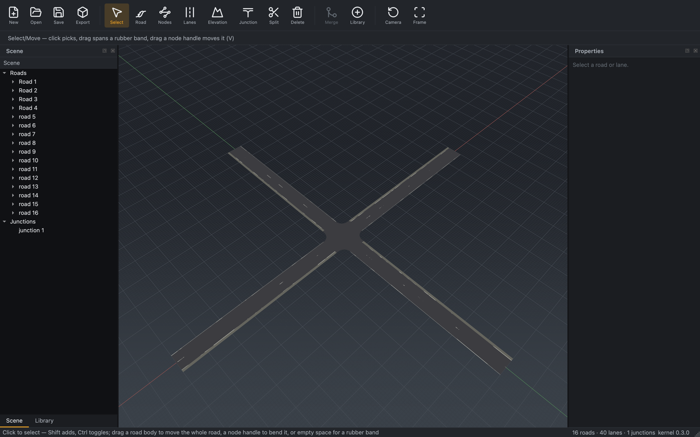

# Junction

*Connect the ends of several roads into a junction, with turning lanes
generated between every arm.*

## Steps

1. Arrange the roads so their ends meet where the junction should be.
2. Activate the **Junction** tool and select the road **ends** (arms) to join —
   two or more.
3. Create the junction. RoadMaker:
   - generates a **connecting road** for each permitted turn between arms,
     matching driving lanes curb-in;
   - records the connections and per-lane links;
   - blends a **2.5D surface** across the junction from the arm elevations;
   - derives a counter-clockwise, closed junction **boundary** for export.

The junction is one undoable command. Moving an arm road later (via
[Edit Nodes](edit-nodes.md)) regenerates the connecting lanes.

To attach a road's end to another road's **body** instead of joining ends,
see [T-junction](t-junction.md) — same tool, one selected end plus a body
anchor.

## Maneuvers

A **maneuver** is one turn through the junction — one connecting road, from one
arm's lane to another's. You never create them: the junction generator plans one
per permitted movement when the junction is made, and regeneration keeps them in
step with the arms. The **Maneuver** tool (**Shift+M** — plain `M` is Move) is
how you take one of them over.

### Selecting a turn

Select the junction and activate the tool. Every turn is drawn dashed; click one
and it turns solid and becomes the active maneuver. Its connecting road is
selected in the scene tree and the Properties panel at the same time, so the
"Maneuvers" group in the panel and the viewport always agree about which turn
you are on. Clicking a **Turn** row in that group works the other way round and
activates it in the viewport. `Esc` clears the selection.

### Reshaping the path

The active turn shows three kinds of handle:

- **Control points** — knobs on the path's interior points. Drag one to swing
  the turn wider or tighter.
- **Midpoint markers** — between consecutive points. Press one and it inserts a
  new control point and drags it in the same gesture.
- **Endpoint dots** — one on each arm face, with a guide segment. Drag one to
  **slide the endpoint across the arm**; it is constrained to the anchor lane's
  cross-section, so the turn can start or finish anywhere within that lane but
  never leaves it.

`Del` removes the point under the cursor. `Esc` cancels a drag in progress and
leaves the file exactly as it was. Each gesture is a single undoable step, and
the path is always refitted so it still meets both arms tangentially — a
reshaped turn stays a legal connecting road.

### Lock Geometry and Convert to Explicit

Reshaping a turn **locks** it in the same step. A locked turn keeps its
hand-shaped geometry through junction regeneration, and it is kept even when the
arms change so much that the plan no longer contains that movement — otherwise
your work would silently disappear the next time an arm moved.

You can lock a turn without reshaping it, which is the same thing as converting
it from a derived turn into an explicit one: the **Lock** checkbox on its row,
or right-click the connecting road ▸ **Convert to explicit (lock geometry)**.
The same menu offers **Return maneuver to derived (unlock geometry)**.

### Turn Type

Each row carries a **Turn Type** — Left, Straight, Right or U-Turn — computed
from the angle between the two arm faces. OpenDRIVE has no turn-type element, so
this is RoadMaker's own label; it describes the movement and never moves any
geometry. Set the combo to name a turn something other than what the geometry
suggests (a gentle slip lane you want signed as a right turn, say), or back to
**Auto** to follow the computed value again.

### Reset and Rebuild

- **Reset** on a row drops everything authored on that one turn and replans it
  from the arms.
- **Rebuild Maneuvers** (the button on the junction, or right-click the junction
  ▸ **Rebuild maneuvers**) replans the whole junction, ignoring every lock:
  hand-shaped geometry is discarded and turns the plan no longer contains are
  dropped. **Turn Type overrides survive** a rebuild — they are labels, not
  geometry.

Both are single undoable steps, so a rebuild you regret is one `Ctrl+Z` away.

### Add U-Turn

The generator never plans a U-turn — turning back onto the arm you arrived on is
a policy decision, not a derivable movement. Right-click the junction ▸
**Add U-Turn…** and pick an arm to add one: it connects that arm's innermost
incoming lane to its innermost outgoing lane and arrives locked, which is what
keeps regeneration from dropping it. A U-turn between two adjacent lanes can be
too tight to fit, and the editor says so instead of producing a bad curve.

An explicit U-turn has no derived path to fall back on, so it cannot be Reset —
delete its connecting road instead. Its row's Reset button is disabled and says
so.

### What is saved

The turns themselves are ordinary OpenDRIVE: real connecting roads with
`<connection>` and `<laneLink>` entries, which any consumer reads. What is
specific to RoadMaker — the lock, the Turn Type override, the two endpoint
slides and the interior control points — is saved alongside them in the
junction's `rm:maneuver` extension record. Reopening the file restores every
one of them, and a file re-saved without edits is byte-identical. Another tool
that ignores the extension still gets a fully valid junction with your
hand-shaped geometry baked into the connecting roads.

## Signalization

Once a junction has its arms and maneuvers, the **Signal** tool (**G**, in the
*Signals & Signs* toolbar group) fits it out with traffic lights or stop signs
in one step. Activate the tool and click the junction: the Properties panel
grows a **Signalization** group.

### Auto Signalize

Pick a **template**, optionally a **mount prop** to hang under each head, then
press **Auto Signalize** (or right-click the junction ▸ **Auto signalize** and
pick a template). Four templates ship — two dynamic (traffic lights), two static
(signs):

- **Protected left (4-phase)** — a light on every approach, plus a protected-left
  light wherever an approach actually has a left turn.
- **Two phase (permissive lefts)** — a light on every approach, one phase group
  per axis, lefts unprotected.
- **All-way stop** — a stop sign on every approach.
- **Two-way stop** — stop signs on the minor axis only (the approaches with fewer
  incoming lanes).

RoadMaker places one logical signal per approach at that approach's stop line,
groups the lights of the dynamic templates into **controllers** (OpenDRIVE
signal groups), and lists one read-only row per approach showing the signals it
carries and the group they belong to. The **static templates create no
controllers** — a stop-controlled junction has no phases, so there is no phase
data to make. The templates do not assume four arms: they cluster the approaches
into axes by heading, so a three-arm T-junction signalizes just as cleanly.

The signal heads render in the viewport through the ordinary prop path, so you
see them immediately. When the phase editor lands (p4-s8) it edits the
controllers these templates create.

### Mount props

Choosing a **mount prop** also drops that prop model at each head and records the
logical-signal → physical-object pairing in the file, so the head has a physical
representation and neither is ever an orphan. The pairing is stored as a *list*
of objects per signal, ready for multi-part signal assemblies without any change
to the file format.

### Clear Signalization

**Clear Signalization** (the button, or right-click the junction ▸ **Clear
signalization**) removes exactly what a signalization authored — its signals,
controllers and mount props — and leaves any hand-placed signs of other types
alone. Re-running Auto Signalize with a different template clears the previous
one first, so you never accumulate two generations of heads.

Both are single undoable steps. Signalizing a junction and pressing `Ctrl+Z`
returns the file byte-for-byte to its pre-signalization state.

### What is saved

The signals and controllers are ordinary OpenDRIVE — real `<signal>` elements,
top-level `<controller>`/`<control>` groups, and a `<junction><controller>`
synchronization reference — that any consumer reads. Which template you applied
and the signal → mount-prop pairings ride the junction's `rm:signal` and
`rm:signalmount` extension records, so reopening the file shows the current
template and a re-save without edits is byte-identical. A junction with no
signalization writes none of these, so existing files are untouched.

A foreign junction (read from another tool's file, with no recorded arms) can be
inspected but not signalized until you recreate it — the same rule as maneuvers.

## Notes

- The selected arms are remembered on the junction, so it can be regenerated
  after edits; junctions from foreign files load without this list and cannot
  regenerate until recreated.
- The sample `assets/samples/t_junction.xodr` is a ready-made three-road
  junction to open and inspect
  ([Running → Sample files](../getting-started/running.md#sample-files)).

## Reference

[M2 editing tools §6 (Create Junction)](../design/m2/02_editing_tools.md) and
[junction blending](../design/m2/03_junction_blending.md) — connecting-road
generation, the blended surface, and the exported reference line / elevation
grid / boundary. [§6c (Maneuver)](../design/m2/02_editing_tools.md) covers the
maneuver query, the six commands and the regeneration guard; and
[§6d (Signal)](../design/m2/02_editing_tools.md) covers the controller layer,
the `junction_signals()` query, the four templates and the two signalization
commands. The `rm:maneuver`, `rm:signal` and `rm:signalmount` payloads are
registered in
[ADR-0008](../decisions/0008-persistence-layers-asam-first.md).
