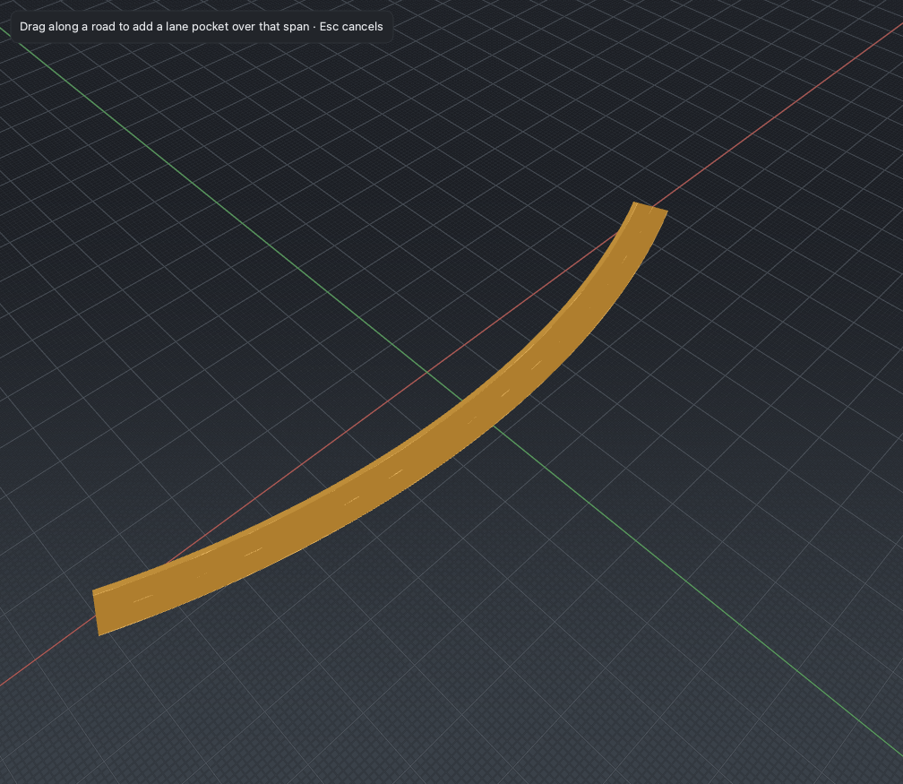

# Lane Add

*Drop a self-contained pocket lane into the middle of a road — a lane that
tapers up from nothing and back down, all within one road.*

## Steps

1. Select a road, then activate the **Lane Add** tool (`A`).
2. Drag along the side of the road where the pocket should go. The drag defines
   the span `[s0, s1]`; the side (left or right of the reference line) follows
   which side you drag on.
3. Release. Lane Add inserts one lane on that side whose width tapers **0 →
   full → 0** across the span, so the pocket opens and closes inside the road.

The span is clamped to stay interior to the road, so the pocket never reaches an
end and needs no cross-section links to neighbouring roads. The whole insertion
is one undoable command.

## Notes

- Use Lane Add for a lay-by, a short parking bay, or a passing pocket — anything
  that begins and ends within a single road.
- For a lane that starts partway along a road and then runs all the way to its
  end (a lane that must link across every downstream lane-section seam), use
  [Lane Form](lane-form.md). For a turn lane that tapers up and holds full to a
  junction, use [Lane Carve](lane-carve.md).
- To add a lane across a road's *entire* length, use the
  [Lane](lane-profile.md) tool's Add left / Add right instead.

## Reference

[M2 editing tools §4](../design/m2/02_editing_tools.md) and the
[P2 discovery report](../roadmap/pillars/p2_discovery.md).
