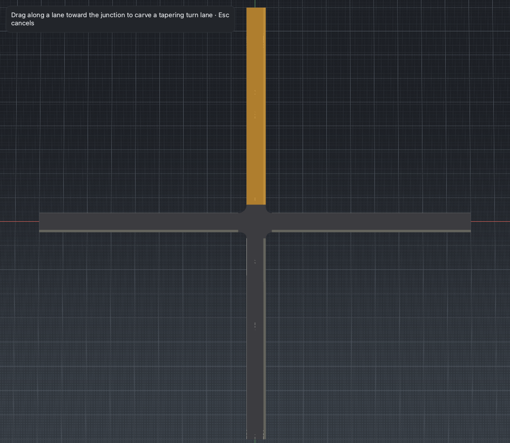

# Lane Carve

*Carve a turn lane on a junction approach — a lane that tapers up from nothing
and then holds full width to the junction, where the junction absorbs it.*

## Steps

1. Select the road approaching a junction, then activate the **Lane Carve** tool
   (**Shift+C**).
2. Drag along the lane toward the junction. The drag defines the taper span
   `[s_start, s_end]` on the side you drag on.
3. Release. Lane Carve adds a lane whose width ramps **0 → full** over the
   dragged span and then **holds full to the road's terminus**, where junction
   regeneration picks it up as an approach lane.

`s_start` must lie in the road's final lane section — the section that meets the
junction. The carve is one undoable command; regenerating the junction turns the
held-full tail into a connecting lane.

## Notes

- Lane Carve is the tool for a dedicated left- or right-turn lane at an
  intersection. The taper is where traffic peels off; the full-width tail is the
  storage length up to the stop line.
- For a lane that opens and closes inside a road, use [Lane Add](lane-add.md);
  for one that grows to the road end without a junction to absorb it, use
  [Lane Form](lane-form.md).
- After carving, regenerate or rebuild the [Junction](junction.md) so the new
  approach lane is connected through the intersection.

## Reference

[M2 editing tools §4](../design/m2/02_editing_tools.md) and the
[P2 discovery report](../roadmap/pillars/p2_discovery.md).
