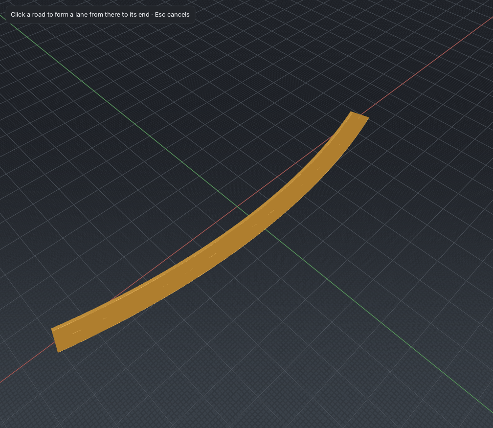

# Lane Form

*Grow a new lane from a point partway along a road all the way to its end,
carried across every downstream lane-section seam as a properly linked
carriageway.*

## Steps

1. Select a road, then activate the **Lane Form** tool (**Shift+A**).
2. Drag from where the new lane should begin along the side it should occupy.
   The start point sets `s_start`; the lane takes the numbering position you
   drag toward.
3. Release. Lane Form creates an interior lane that starts at **zero width** at
   `s_start` and holds **full width to the road's end**.

Where the road already has several lane sections, the new lane is inserted or
appended in each section it spans, and the seams between them are joined with
matched predecessor/successor links — so the lane runs to the road end as one
continuous, linked carriageway rather than a stack of disconnected stubs. The
whole operation is a single undoable command.

## Notes

- Lane Form is the tool for a lane that *appears* along a road and then stays —
  an added through lane, a merge lane, a widening. It is backward-unlinked at
  `s_start` (the lane is born there) and fully linked from there to the end.
- For a pocket that opens and closes inside the road, use
  [Lane Add](lane-add.md). For a turn lane that tapers up and is absorbed by a
  junction at the road's terminus, use [Lane Carve](lane-carve.md).
- Across-seam linking follows
  `asam.net:xodr:1.4.0:road.lane.link.lanes_across_laneSections` (§11.6).

## Reference

[M2 editing tools §4](../design/m2/02_editing_tools.md) and the
[P2 discovery report](../roadmap/pillars/p2_discovery.md). Lane linking and
sections: [OpenDRIVE conventions](../domain/opendrive.md).
