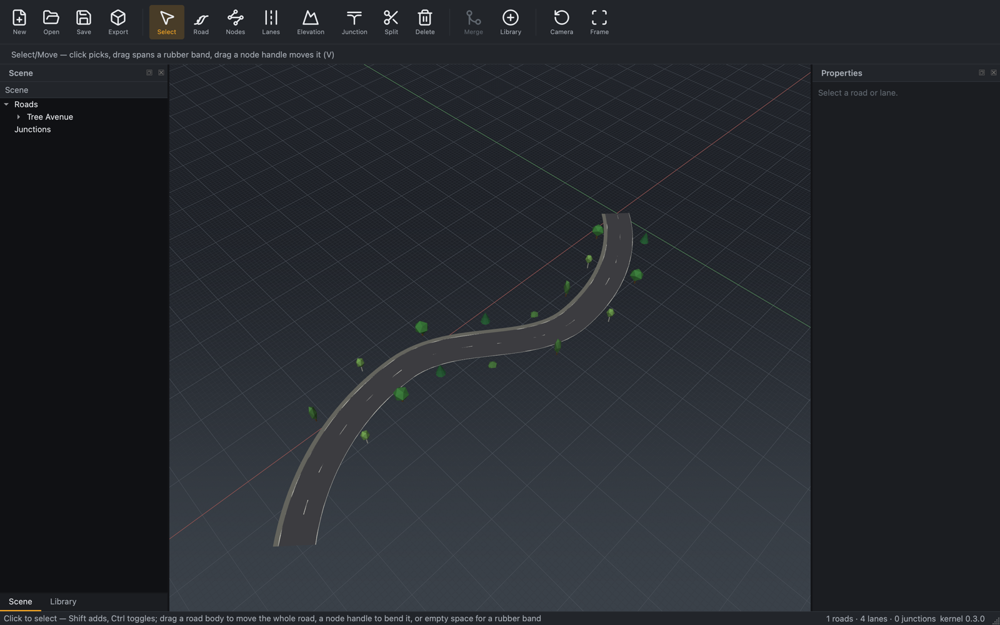

# Objects & signals

*Add the scene furniture that makes a road network legible and simulator-ready:
crosswalks, props, lane arrows, stop lines, traffic lights, and signs.*

RoadMaker follows the ASAM OpenDRIVE split:

- **Objects** (`<object>`) — crosswalks, trees and other props, poles, and
  painted road markings that are not mandatory control signals (lane arrows,
  stop lines, zebra crossings).
- **Signals** (`<signal>`) — traffic-control signs and lights: traffic lights,
  speed limits, pedestrian-crossing warnings.

Each is placed in road `s`/`t`/`zOffset` coordinates and validated against the
relevant ASAM rules, so an exported `.xodr` carries real semantics — not just
geometry.

## Authoring today (kernel & Python)

The kernel represents, validates, writes, and meshes the full GS-1 object and
signal set, and you can author it from the Python package now:

| Example | What it authors |
|---|---|
| [`place_objects.py`](../../python/examples/place_objects.py) | A crosswalk, a pole, and a tree line (`<repeat>`) |
| [`place_signals.py`](../../python/examples/place_signals.py) | A traffic light, a speed-limit sign, a pedestrian-crossing sign |
| [`road_marks.py`](../../python/examples/road_marks.py) | A true double-yellow centre line and dashed white edge lines |

```sh
python python/examples/place_signals.py signals.xodr
```

Painted markings that are objects — **crosswalks** (zebra), **stop lines**, and
**lane arrows** (left / straight / right) — mesh as generated paint geometry
(no asset needed), and multi-line lane marks such as `solid solid` render as
true dual stripes.

## In the editor

**Props and signals** place directly in the editor: drag one from the
[**Library**](library.md) onto a road and RoadMaker adds it, snapped to the
nearest road in `s`/`t`:

- **Props** become an `<object>` typed by what they are — vegetation (trees,
  shrub) as `type="tree"`, streetlights as `type="pole"`, buildings as
  `type="building"`.
- **Traffic lights** become a dynamic `<signal>`; **traffic signs** (generic,
  stop, yield) a static one.



Placed props and signals select, move, delete, duplicate, and round-trip
through save/reload and the glTF / USD exports. Select a signal and its
properties panel shows the kind (dynamic light or static sign), its
type / subtype and country, and lets you nudge its road-relative pose —
`s` along the road, `t` across it, and the heading offset — each edit an
undoable command.

### Placing props: Prop Point & Prop Curve

Two tools place the selected [**Library**](library.md) prop (a tree or shrub)
without leaving the viewport. Both snap to the nearest road in `s`/`t` — props
are road-relative, so a click in open space, away from any road, is rejected
with a hint rather than placed at a floating world position.

**Prop Point** (`T`) places one prop per click:

- Click on or beside a road and the prop lands under the cursor, snapped to the
  road (the verge is fine — any `t` within reach). It is a single undo step.
- A ghost circle of the model's footprint previews where the click will land.
- Drag a prop already in the scene to move it along its road; the whole drag
  commits as exactly **one** `move` on release, and `Esc` cancels it cleanly.

**Prop Curve** (`⇧T`) distributes a run of props along a path:

- Click waypoints along a road — the first click anchors the run to the road
  under it. A live preview fits a smooth curve through the points and shows one
  ghost per prop at the current spacing.
- `[` and `]` adjust the spacing (default 5 m) in half-metre steps; the current
  value is shown in the status bar.
- `Enter` or a double-click **bakes** the run: every previewed prop becomes an
  individual `<object>`, added as a **single** undo step. Samples that would
  leave the anchor road are skipped (the toast reports how many). `Backspace`
  removes the last point; `Esc` cancels before the bake.
- Because the bake produces plain props, each one afterwards selects, moves, and
  deletes on its own — there is no group to break apart.

**Prop Span** (`⇧S`) places a repeating run of one prop as a single object:

- Click two stations on the **same** road — the first anchors the span and pins
  its lateral offset, the second sets the far end (a click that leaves the anchor
  road is ignored). A live preview shows one ghost per instance.
- `[` and `]` adjust the spacing between instances (default 5 m) in half-metre
  steps.
- `Enter` or a double-click commits the span as **one** `<object>` carrying one
  `<repeat>` — a single undo step. The kernel expands the repeat when it meshes
  and exports, so the file stays compact.
- A span carries exactly **one model**: a [prop set](#prop-sets) is resolved to a
  single tree or shrub for the whole run (a `<repeat>` cannot mix models). Use
  Prop Curve or Prop Polygon to scatter a mix.
- **Known limitation:** a committed span cannot be dragged to a new position yet
  — moving its object relocates the object's own origin, not the repeat. To
  reposition a span, delete it and draw a new one. A span editor is planned.

**Prop Polygon** (`⇧P`) scatters props to fill a region:

- Click three or more vertices to outline a region; the interior may sit well off
  the road (a park, a wide verge). Each scattered prop still anchors to the
  nearest road within reach, so the region need not hug the carriageway.
- `[` and `]` adjust the density (props per 100 m²); `R` re-scatters with a fresh
  random layout at the same density. The preview updates in place.
- `Enter` or a double-click **bakes** the scatter: every previewed prop becomes an
  individual `<object>`, added as a **single** undo step. Samples with no road in
  reach are skipped (the toast reports how many). `Backspace` removes the last
  vertex; `Esc` cancels before the bake.
- A [prop set](#prop-sets) scatters a **mix** — one model is drawn per instance by
  the set's portions.

### Prop sets

A **prop set** is a Library asset that names several tree/shrub models with
relative *portions* (for example three pines to one birch). Placing a set draws
a model from those weighted portions:

- **Prop Point** draws one model per click; **Prop Curve** and **Prop Polygon**
  draw one per placed instance, so a run or region shows the mix.
- **Prop Span** draws **once** for the whole span — a repeating run is a single
  object with a single model.

Create or edit a set from the Library (right-click → *New prop set…*); the baked
props are plain objects and never reference the set, so editing the set later
does not disturb props already placed.

### Junction markings

The painted markings a junction needs on every arm author in one action each.
Right-click the **junction floor** — the blended surface in the middle, between
the arms — and pick from:

| Action | Authors |
|---|---|
| **Add crosswalks to all arms** | one zebra `<object type="crosswalk">` per arm, spanning its driving lanes just inside the junction |
| **Add stop lines to all arms** | a solid `<object type="roadMark" subtype="signalLines">` across each arm's approach lanes, set back behind the crosswalk |
| **Add lane arrows to all arms** | a straight arrow on each approach lane, pointing into the junction and set back behind the stop line |
| **Add centre lines to all arms** | a double-yellow centre line (`roadMark` `solid solid`, yellow) on lane 0 of each arm, replacing the one the road template laid down |

Each action covers **every arm at once and is a single undo step** — Ctrl+Z
takes the whole batch back. An action is greyed out when the junction has no
arms it can resolve (a junction read from another tool's file, say), so it
never silently does nothing.

The two-way arms of a plain crossing get a stop line and an arrow **per
approach** — one for each direction of travel — since each side approaches the
junction on its own lanes.

> **Turn arrows.** The editor authors the straight glyph. The `arrowLeft` and
> `arrowRight` variants are modelled and render, but choosing which lane gets
> which is Python-side for now — `edit.junction_lane_arrows(network, junction,
> glyph)` takes a callable that picks the subtype per approach lane.

**Poles** still author from the Python package (above) or another OpenDRIVE
tool; open the result in the editor to inspect it.

## Reference

- [M3a kernel — objects & signals](../design/m3a/01_kernel_objects_signals.md)
  — the data model, the authored (GS-1) set, and the validation rules.
- [M3a road-mark completions](../design/m3a/02_road_marks.md) — colour,
  multi-line geometry, and object-based crosswalks / stop lines / arrows.
